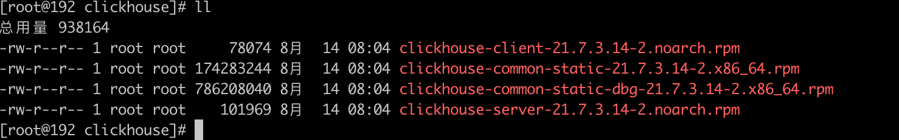
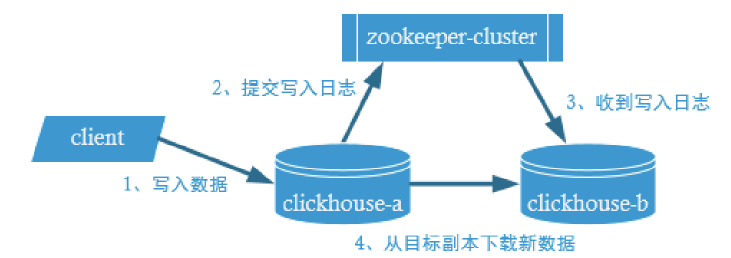
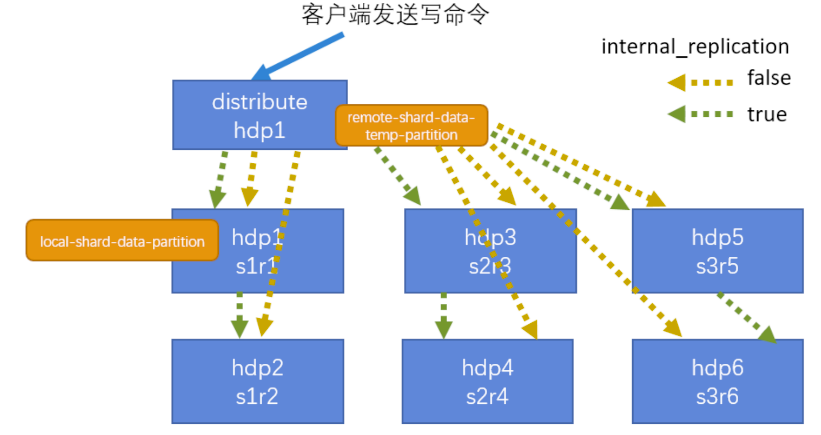
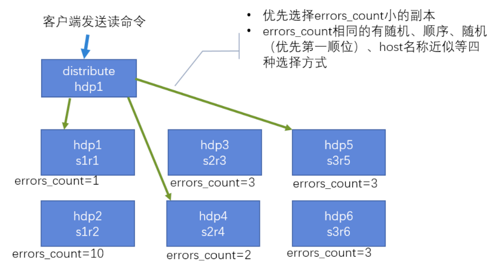

# Clickhouse

## 入门

### 特点

- 列式存储数据库（DBMS)
- 在线分析处理查询（OLAP），分析型
- C++ 实现
- SQL化操作
- 数据分区与线程级并行


## 安装

### 准备工作

1. 确定防火墙处于关闭状态

   ```shell
   systemctl status firewalld 				#查看防火墙状态
   systemctl stop firewalld 					#关闭防火墙
   systemctl disable firewalld				#关闭防火墙开机启动
   ```

2. CentOS取消打开文件数限制

   ```shell
   vim /etc/security/limits.conf
   vim /etc/security/limits.d/20-nproc.conf
   ```

   添加内容

   ```tex
   * soft nofile 65536
   * hard nofile 65536
   * soft nproc 131072
   * hard nproc 131072
   ```

3. CentOS 取消 SELINUX  

   ```shell
    vim /etc/selinux/config
    SELINUX=disabled
   ```

4. 安装依赖

   ```shell
   sudo yum install -y libtool	
   sudo yum install -y *unixODBC
   ```

### 安装

1. 上传rpm包

   

2. 安装并检查

   ```shell
    rpm -ivh *.rpm 									#安装
    rpm -qa|grep clickhouse 					#查看安装情况
   ```

3. 修改配置文件

   ```
    vim /etc/clickhouse-server/config.xml
    打开注释 <listen_host>::</listen_host>
   ```

4. 启动

   ```
   systemctl start clickhouse-server 				#启动
   systemctl disabled clickhouse-server			#关闭开机自启
   ```

   

## 数据类型

### 整型

#### 有符号

范围：（-2n-1~2n-1-1）

Int8 - [-128 : 127]

Int16 - [-32768 : 32767]

Int32 - [-2147483648 : 2147483647]

Int64 - [-9223372036854775808 : 9223372036854775807]

#### 无符号

范围：（0~2n-1）

UInt8 - [0 : 255]

UInt16 - [0 : 65535]

UInt32 - [0 : 4294967295]

UInt64 - [0 : 18446744073709551615]

### 浮点型

Float32 - float

Float64 – double

### 布尔型

没有单独的类型来存储布尔指，可以使用UInt8类型，取值限制为0或1

### Decimal型

- Decimal32(s)，相当于 Decimal(9-s,s)，有效位数为 1~9
- Decimal64(s)，相当于 Decimal(18-s,s)，有效位数为 1~18
- Decimal128(s)，相当于 Decimal(38-s,s)，有效位数为 1~38

### 字符串

#### String

字符串可以任意长度。可以包含任意的字节集，包含空字节。

#### FixedString(N)

固定长度N的字符串，N必须是严格的正自然数。当服务端读区长度小于N的字符串的时候，通过在末尾添加空字节来达到N字节长度。当服务端读取长度大于N的字符串的时候，将返回错误消息。

### 枚举型

Enum8 用 'String'= Int8 对描述。

Enum16 用 'String'= Int16 对描述。

CASE:

​	建表语句

```sql
 create table t_enum( x Enum8('hello' = 1, 'word' =2 ) ) ENGINE = TinyLog;
```

​	数据写入语句：

```sql
INSERT INTO t_enum VALUES ('hello'),('word'),('hello');
```

​	查询语句：

```sql
select * from t_enum;
select cast(x,'Int8') from t_enum;
```

### 时间类型

Date: 接受年-月-日字符串，比如'2021-08-14'

Datetime: 接受年-月-日 时:分:秒 字符串，比如'2021-08-14 10:00:00'

Datetime64: 接受年-月-日 时：分：秒.亚秒的字符串，比如 '2021-08-14 10:00:00.00'

### 数组

Array(T):由T类型元素组成的数组。T 可以是任意类型，包含数组类型。 但不推荐使用多维数组，ClickHouse 对多维数组

的支持有限。例如，不能在 MergeTree 表中存储多维数组。

创建数组：

```sql
select array(1,2) as x ,toTypeName(x);
select [1,2] as x , toTypeName(x);
```

## 表引擎

### 作用

- 数据的存储方式和位置，写到哪里以及从哪里读取数据
- 支持那些查询以及如何支持
- 并发数据访问
- 索引的使用（如果存在）
- 是否可以执行多线程的请求
- 数据复制参数

**特别注意：引擎名称大小写敏感**

### TinyLog

​	以列文件的形式保存在磁盘上，不支持索引，没有并发控制。一般保存少量数据的小表，生产环境上作用有限。

```sql
create table t_tinylog (id String,name String ) engine = TinyLog;
```

### Memory

​	内存引擎，数据以未压缩的原始形式直接保存在内存中，服务器重启数据就会消失。读写操作不会相互阻塞，不支持索引，简单查询下性能非常高（10G/s)。一般用户测试，且数据量不大。

### MergeTree

​	ClickHouse 中最强大的表引擎当属 MergeTree（合并树）引擎及该系列（*MergeTree）中的其他引擎，支持索引和分区，地位可以相当于 innodb 之于 Mysql。

建表语句：

```sql
create table t_order_mt(
id UInt32,
sku_id String,
total_amount Decimal(16,2),
create_time Datetime
) engine =MergeTree
partition by toYYYYMMDD(create_time)
primary key (id)
order by (id,sku_id);


insert into t_order_mt values
(101,'sku_001',1000.00,'2020-06-01 12:00:00') ,
(102,'sku_002',2000.00,'2020-06-01 11:00:00'),
(102,'sku_004',2500.00,'2020-06-01 12:00:00'),
(102,'sku_002',2000.00,'2020-06-01 13:00:00'),
(102,'sku_002',12000.00,'2020-06-01 13:00:00'),
(102,'sku_002',600.00,'2020-06-02 12:00:00');
```

#### Partition by 分区（可选）

##### 作用

分区的目的主要是降低扫描范围，优化查询速度。如果不填只会使用一个分区。

##### 分区目录

​	MergeTree 是以列文件+ 索引文件+表定义文件组成的，如果设定了分区，那么这些文件就会保存到不同的分区目录中。

##### 并行

​	分区后，面对涉及跨分区的查询统计，ClickHouse 会以分区为单位并行处理。

##### 数据写入与分区合并

​	任何一个批次的数据写入都会产生一个临时分区，不会纳入任何一个已有的分区。写入

后的某个时刻（大概 10-15 分钟后），ClickHouse 会自动执行合并操作（等不及也可以手动

通过 optimize 执行），把临时分区的数据，合并到已有分区中。

```
optimize table xxxx final;
```

#### Primary key 主键（可选）

​	ClickHouse 中的主键，和其他数据库不太一样，**它只提供了数据的一级索引，但是却不是唯一约束。**这就意味着是可以存在相同 primary key 的数据的。

​	主键的设定主要依据是查询语句中的 where 条件。

​	根据条件通过对主键进行某种形式的二分查找，能够定位到对应的 index granularity,避免了全表扫描。

​	index granularity： 直接翻译的话就是索引粒度，指在稀疏索引中两个相邻索引对应数据的间隔。ClickHouse 中的 MergeTree 默认是 8192。官方不建议修改这个值，除非该列存在大量重复值，比如在一个分区中几万行才有一个不同数据。

#### order by (必选)

​	order by 设定了分区内的数据按照哪些字段顺序进行有序保存。

​	order by 是 MergeTree 中唯一一个必填项，甚至比 primary key 还重要，因为当用户不设置主键的情况，很多处理会依照 order by 的字段进行处理（比如后面会讲的去重和汇总）。

​	**要求：主键必须是 order by 字段的前缀字段。**

#### 二级索引

​	目前在 ClickHouse 的官网上二级索引的功能在 v20.1.2.4 之前是被标注为实验性的，在这个版本之后默认是开启的。 

##### 老版本使用二级索引需要增加设置

​	是否允许使用实验性的二级索引（v20.1.2.4 开始，这个参数已被删除，默认开启）

```
set allow_experimental_data_skipping_indices=1;
```

##### 创建测试表

```sql
create table t_order_mt2(
id UInt32,
sku_id String,
total_amount Decimal(16,2),
create_time Datetime,
INDEX a total_amount TYPE minmax GRANULARITY 5
) engine =MergeTree
partition by toYYYYMMDD(create_time)
primary key (id)
order by (id, sku_id);


insert into t_order_mt2 values
(101,'sku_001',1000.00,'2020-06-01 12:00:00') ,
(102,'sku_002',2000.00,'2020-06-01 11:00:00'),
(102,'sku_004',2500.00,'2020-06-01 12:00:00'),
(102,'sku_002',2000.00,'2020-06-01 13:00:00'),
(102,'sku_002',12000.00,'2020-06-01 13:00:00'),
(102,'sku_002',600.00,'2020-06-02 12:00:00');
```

#### 数据TTL

​	TTL 即 Time To Live，MergeTree 提供了可以管理数据表或者列的生命周期的功能。

##### 列级别TTL

###### 	创建测试表

```
create table t_order_mt3(
id UInt32,
sku_id String,
total_amount Decimal(16,2) TTL create_time+interval 10 SECOND,
create_time Datetime 
) engine =MergeTree
partition by toYYYYMMDD(create_time)
primary key (id)
order by (id, sku_id);


insert into t_order_mt3 values
(106,'sku_001',1000.00,'2020-06-12 22:52:30'),
(107,'sku_002',2000.00,'2020-06-12 22:52:30'),
(110,'sku_003',600.00,'2020-06-13 12:00:00');
```

##### 表级别TTL

```sql
alter table t_order_mt3 MODIFY TTL create_time + INTERVAL 10 SECOND;
```

能够使用的时间周期：

\- SECOND

\- MINUTE

\- HOUR

\- DAY

\- WEEK

\- MONTH

\- QUARTER

\- YEAR

### ReplacingMergeTree

​	ReplacingMergeTree 是MergeTree的一个变种，它存储特性完全继承 MergeTree，只是多了一个去重的功能。 尽管 MergeTree 可以设置主键，但是 primary key 其实没有唯一约束的功能。如果你想处理掉重复的数据，可以借助这个 ReplacingMergeTree。 

##### 去重时机

​	数据的去重只会在合并的过程中出现。合并会在未知的时间在后台进行，所以你无法预先作出计划。有一些数据可能仍未被处理。

##### 去重范围

​	如果表经过了分区，去重只会在分区内部进行去重，不能执行跨分区的去重。所以ReplacingMergeTree 能力有限，ReplacingMergeTree 适用于在后台清除重复的数据以节省空间，但他不保证没有重复的数据出现。

##### 创建表

```sql
create table t_order_rmt(
id UInt32,
sku_id String,
total_amount Decimal(16,2) ,
create_time Datetime 
) engine =ReplacingMergeTree(create_time)
partition by toYYYYMMDD(create_time)
primary key (id)
order by (id, sku_id);

insert into t_order_rmt values
(101,'sku_001',1000.00,'2020-06-01 12:00:00') ,
(102,'sku_002',2000.00,'2020-06-01 11:00:00'),
(102,'sku_004',2500.00,'2020-06-01 12:00:00'),
(102,'sku_002',2000.00,'2020-06-01 13:00:00'),
(102,'sku_002',12000.00,'2020-06-01 13:00:00'),
(102,'sku_002',600.00,'2020-06-02 12:00:00');
```

##### 结论

- 实际上是使用 order by 字段作为唯一键
- 去重不能夸分区
- 只用同一批插入（新版本）或合并分区时才会进行去重
- 认定重复的数据保留，版本字段值最大的
- 如果版本字段相同则按插入顺序保留最后一笔

### SummingMergetree

​	对于不查询明细，只关心以维度急性汇总聚合结果的场景。如果只使用普通的MergeTree的话，无论是存储空间的开销，还是查询时临时聚合的开销都比较大。ClickHouse 为了这种场景，提供了一种能够“预聚合”的引擎，SummingMergeTree。

##### 创建表

```sql
create table t_order_smt(
id UInt32,
sku_id String,
total_amount Decimal(16,2) ,
create_time Datetime 
) engine =SummingMergeTree(total_amount)
partition by toYYYYMMDD(create_time)
primary key (id)一次
order by (id,sku_id );

insert into t_order_smt values
(101,'sku_001',1000.00,'2020-06-01 12:00:00'),
(102,'sku_002',2000.00,'2020-06-01 11:00:00'),
(102,'sku_004',2500.00,'2020-06-01 12:00:00'),
(102,'sku_002',2000.00,'2020-06-01 13:00:00'),
(102,'sku_002',12000.00,'2020-06-01 13:00:00'),
(102,'sku_002',600.00,'2020-06-02 12:00:00');
```

##### 结论

- SummingMergeTree() 中指定的列作为汇总的数据列
- 可以填写多列必须数字列，如果不填，以所有非维度列且为数字列的字段为汇总数据列
- 以 order by 的列为准，作为维度列
- 其他的列按插入顺序保留第一行
- 不在一个分区的数据不会被聚合
- 只有在同一批次插入(新版本)或分片合并时才会进行聚合

## SQL 操作

### Inster

标准语法：

```sql
insert into [table_name] values(…),(….)
```

表到表的插入语法：

```sql
insert into [table_name] select a,b,c from [table_name_2]
```

### Update 和Delete

ClickHouse 提供了 Delete 和 Update 的能力，这类操作被称为 Mutation 查询，它可以看做 Alter 的一种。虽然可以实现修改和删除，但是和一般的 OLTP 数据库不一样，**Mutation** **语句是一种很“重”的操作，而且不支持事务。**“重”的原因主要是每次修改或者删除都会导致放弃目标数据的原有分区，重建新分区。所以尽量做批量的变更，不要进行频繁小数据的操作。

删除语法：

```sql
alter table t_order_smt delete where sku_id ='sku_001';
```

修改操作：

```sql
alter table t_order_smt update total_amount=toDecimal32(2000.00,2) where id =102;
```

### 查询操作

- 支持子查询
- 支持CTE(Common Table Expression 公用表表达式 with 子句)
- 支持各种JOIN，但是JOIN操作无法使用缓存，所以即使时两次相同的JOIN语句，Clickhouse也会视为两条新的SQL
- 函数窗口（官方真正测试中）
- 不支持自定义函数
- Group By 操作增加了 with rollup \ with cube \ with total 用来计算小计和总和

#### 使用案例

```sql
-- with rollup ：从右至左去掉纬度进行小计 
select id , sku_id,sum(total_amount) from t_order_mt group by id,sku_id with rollup;
-- with cube ：从右至左去掉维度进行小计，再从左至右去掉维度进行小计
select id , sku_id,sum(total_amount) from t_order_mt group by id,sku_id with cube;
-- with totals: 只计算合计
select id , sku_id,sum(total_amount) from t_order_mt group by id,sku_id with totals;
```

### alter 操作

#### 新增字段

```sql
alter table tableName add column newcolname String after col1;
```

#### 修改字段类型

```sql
alter table tableName modify column newcolname String;
```

#### 删除字段

```sql
alter table tableName drop column newcolname;
```

## 副本

​	副本的目的主要是为了保障数据的高可用性，即使一台Clickhouse 节点宕机，那么也可以从其他服务器获取相同的数据。

### 副本写入流程



### 配置步骤

1. 启动zookeeper集群

2. 配置Clickhouse 下的Zookeeper集群地址，在/etc/clichouse-server/config.d 目录下创建metrika.xml

   ```xml
   <?xml version="1.0"?>
   <yandex>
   	<zookeeper-servers>
   	<node index="1">
   		<host>zookeeper1</host>
   		<port>2181</port>
   	</node>
   	<node index="2">
   		<host>zookeeper2</host>
   		<port>2181</port>
   	</node>
   	<node index="3">
   		<host>zookeeper3</host>
   		<port>2181</port>
   	</node>
   </zookeeper-servers>
   </yandex>
   ```

3. 修改config.xml 增加

   ```xml
   <zookeeper incl="zookeeper-servers" optional="true" />
   <include_from>/etc/clickhouse-server/config.d/metrika.xml</include_from>
   ```

4. 同步集群其他机器

5. 重启Clickhouse 集群

#### 建表语句

```sql
create table t_order_rep2 (
	id UInt32,
	sku_id String,
	total_amount Decimal(16,2),
	create_time Datetime
) engine =ReplicatedMergeTree('/clickhouse/table/01/t_order_rep','rep_102')
partition by toYYYYMMDD(create_time)
primary key (id)
order by (id,sku_id);
```

ReplicatedMergeTree 参数：

1. 参数一分片zk_path 一般按照：/clickhouse/database/table/{shard}/{table_name}的格式
2. 参数二副本名名称，相同的分片副本名称不能相同

## 分片集群

​	副本解决了数据的高可用性，降低丢失的风险，无法解决数据的横向扩容。Clickhouse通过数据分片解决数据的水平切分问题，再通过Distributed 表把数据拼接在一起使用。Distributed 表引擎本身不存储数据。

### 集群写入流程



### 集群读取流程



## Explain 查看执行计划

​	在 clickhouse 20.6 版本之前要查看 SQL 语句的执行计划需要设置日志级别为 trace 才能可以看到，并且只能真正执行 sql，在执行日志里面查看。在 20.6 版本引入了原生的执行计划的语法。

### 基本语法

```sql
EXPLAIN [AST | SYNTAX | PLAN | PIPELINE] [setting = value, ...] 
SELECT ... [FORMAT ...]
```

- PLAN : 用于查看执行计划，默认值
  - header: 打印计划中各个步骤的head说明，默认关闭，默认值0
  - description:打印计划中各个步骤的描述，默认开启，默认值1
  - actions：打印计划中各个步骤的详细信息，默认关闭，默认值0
- AST：用于查看语法树
- SYNTAX:用于优化语法
- PIPELINE: 用于查看PIPELINE 计划
  - header: 打印计划中各个步骤的head说明，默认关闭
  - graph: 用DOT图形语言描述管道图，默认关闭，需要查看相关的图形配合graphviz 查看
  - actions: 如果开启了graph，紧凑打印，默认开启

## 建表优化

### 数据类型

#### 时间字段类型

​	虽然 ClickHouse 底层将 DateTime 存储为时间戳 Long 类型，但不建议存储 Long 类型，因为 DateTime 不需要经过函数转换处理，执行效率高、可读性好。

#### 空值存储类型

​	官方已经指出 **Nullable** **类型几乎总是会拖累性能**，因为存储 Nullable 列时需要创建一个额外的文件来存储 NULL 的标记，并且 Nullable 列无法被索引。

```sql
CREATE TABLE t_null(x Int8, y Nullable(Int8)) ENGINE TinyLog;
```

### 分区和索引

​	一般选择**按天分区**，也可以指定为 Tuple()，以单表一亿数据为例，分区大小控制在 10-30 个为最佳。

​	必须指定索引列，ClickHouse 中的索引列即排序列，通过 order by 指定，一般在查询条件中经常被用来充当筛选条件的属性被纳入进来；可以是单一维度，也可以是组合维度的索引；通常需要满足高级列在前、查询频率大的在前原则；还有基数特别大的不适合做索引列，如用户表的 userid 字段；通常**筛选后的数据满足在百万以内为最佳**。

### 表参数

​	Index_granularity 是用来控制索引粒度的，默认是 8192，如非必须不建议调整。

如果表中不是必须保留全量历史数据，建议指定 TTL（生存时间值），可以免去手动过期历史数据的麻烦，TTL 也可以通过 alter table 语句随时修改。

### 写入删除优化

1. 尽量不要执行单条或小批量删除和插入操作，这样会产生小分区文件，给后台Merge 任务带来巨大压力
2. 不要一次写入太多分区，或数据写入太快，数据写入太快会导致 Merge 速度跟不上而报错，一般建议每秒钟发起 2-3 次写入操作，每次操作写入 2w~5w 条数（依服务器性能而定）

### 常见配置

#### CPU资源

|                   配置                    |                             描述                             |
| :---------------------------------------: | :----------------------------------------------------------: |
|           background_pool_size            | 后台线程池的大小，merge线程就是在该线程池中执行，但是该线程池不仅仅是该merge线程用的，默认值16，允许的前提下改成CPU核数的2倍（线程数） |
|       background_schedule_pool_size       | 执行后台任务（复制表、Kafka流、DNS缓存更新）的线程数。默认128，建议改成CPU核数的2倍 |
| background_distributed_schedule_pool_size | 设置为分布式发送执行后台任务的线程数，默认 16，建议改成 cpu个数的2倍 |
|          max_concurrent_queries           | 最大并发处理的请求数(包含 select,insert 等)，默认值 100，推荐 150～300 |
|                max_threads                |       设置单个查询所能使用的最大CPU个数，默认是CPU核数       |

#### 内存资源

|                配置                |                             描述                             |
| :--------------------------------: | :----------------------------------------------------------: |
|          max_memory_usage          | 此参数在 users.xml 中,表示单次 Query 占用内存最大值，该值可以设置的比较大，这样可以提升集群查询的上限。保留一点给 OS，比如 128G 内存的机器，设置为 100GB。 |
| max_bytes_before_external_group_by | 一般按照 max_memory_usage 的一半设置内存，当 group 使用内存超过阈值后会刷新到磁盘进行。因为 clickhouse 聚合分两个阶段：查询并及建立中间数据、合并中间数据，结合上一项，建议 50GB。 |
|   max_bytes_before_external_sort   | 当 order by 已使用 max_bytes_before_external_sort 内存就进行溢写磁盘(基于磁盘排序)，如果不设置该值，那么当内存不够时直接抛错，设置了该值 order by 可以正常完成，但是速度相对存内存来说肯定要慢点(实测慢的非常多，无法接受)。 |
|       max_table_size_to_drop       | 此参数在 config.xml 中，应用于需要删除表或分区的情况，默认是50GB，意思是如果删除 50GB 以上的分区表会失败。建议修改为 0，这样不管多大的分区表都可以删除。 |

#### 存储

​	ClickHouse 不支持设置多数据目录，为了提升数据 io 性能，可以挂载虚拟券组，一个券组绑定多块物理磁盘提升读写性能，多数据查询场景 SSD 会比普通机械硬盘快 2-3 倍。

## Clickhouse 语法优化规则

​	clickhouse 的SQL 优化规则是基于RBO（Rule Based Optimization）

### Count 优化

​	在调用Count 函数时，如果使用的是count()或者Count(*) ，并且没有Where 条件，则会直接使用system.tables 的total_rows。如果Count具体的字段则不会使用此向优化。

### 消除子查询重复字段

​	子查询中包含相同的字段会直接删除，即使重命名也会如此

### 谓词下推

​	当 group by 有 having 子句，但是没有 with cube、with rollup 或者 with totals 修饰的时候，having 过滤会下推到 where 提前过滤。

### 聚合计算外推

​	聚合函数内的计算会外推，例如

```sql
EXPLAIN SYNTAX
SELECT sum(UserID * 2)
FROM visits_v1
#返回优化后的语句
SELECT sum(UserID) * 2
FROM visits_v1
```

### 聚合函数消除

​	如果对聚合键，也就是 group by key 使用 min、max、any 聚合函数，则将函数消除

### 删除重复的 Order by key

```sql
EXPLAIN SYNTAX
SELECT *
FROM visits_v1
ORDER BY
UserID ASC,
UserID ASC,
VisitID ASC,
VisitID ASC
#返回优化后的语句：
select
……
FROM visits_v1
ORDER BY 
UserID ASC,
VisitID ASC
```

### 删除重复的 Limit by key

```sql
EXPLAIN SYNTAX
SELECT *
FROM visits_v1
LIMIT 3 BY
VisitID,
VisitID
LIMIT 10
#返回优化后的语句：
select
……
FROM visits_v1
LIMIT 3 BY VisitID
LIMIT 10
```

### 删除重复的Using key

```sql
EXPLAIN SYNTAX
SELECT
a.UserID,
a.UserID,
b.VisitID,
a.URL,
b.UserID
FROM hits_v1 AS a
LEFT JOIN visits_v1 AS b USING (UserID, UserID)
#返回优化后的语句：
SELECT 
UserID,
UserID,
VisitID,
URL,
b.UserID
FROM hits_v1 AS a
ALL LEFT JOIN visits_v1 AS b USING (UserID)
```

### 标量替换

​		如果子查询只返回一行数据，在被引用的时候用标量替换

### 三元运算优化

​		如果开启了 optimize_if_chain_to_multiif 参数，三元运算符会被替换成 multiIf 函数

## 查询优化

### 单表查询优化

#### Prewhere代替Where

​	Prewhere 和 where 语句的作用相同，用来过滤数据。不同之处在于 prewhere 只支持*MergeTree 族系列引擎的表，首先会读取指定的列数据，来判断数据过滤，等待数据过滤之后再读取 select 声明的列字段来补全其余属性。

​	当查询列明显多于筛选列时使用 Prewhere 可十倍提升查询性能，Prewhere 会自动优化执行过滤阶段的数据读取方式，降低 io 操作。

​	默认情况，我们肯定不会关闭 where 自动优化成 prewhere，但是某些场景即使开启优化，也不会自动转换成 prewhere，需要手动指定 prewhere：

- 使用常量表达式
- 使用默认值为alias类型的字段
- 包含了arrayJOIN，globalIn,globalNotIn或者indexHint的查询
- select查询的列字段和where的谓词相同
- 使用了主键字段

#### 数据采样

​	采样修饰符只有在 MergeTree engine 表中才有效，且在创建表时需要指定采样策略。

```sql
#建表指定采样策略
CREATE TABLE datasets.hits_v1 (
 ......
 ) ENGINE = MergeTree() 
PARTITION BY toYYYYMM(EventDate) 
ORDER BY (CounterID, EventDate, intHash32(UserID)) 
SAMPLE BY intHash32(UserID) 
SETTINGS index_granularity = 8192;
#查询使用采样功能
SELECT Title,count(*) AS PageViews 
FROM hits_v1
SAMPLE 0.1 #代表采样 10%的数据,也可以是具体的条数
WHERE CounterID =57
GROUP BY Title
ORDER BY PageViews DESC LIMIT 1000
```

#### 列裁剪与分区裁剪

​	数据量太大时应避免使用 select * 操作，查询的性能会与查询的字段大小和数量成线性表换，字段越少，消耗的 io 资源越少，性能就会越高。

#### Order by 结合 Where 、limit

​	千万以上数据集进行 order by 查询时需要搭配 where 条件和 limit 语句一起使用。

#### 避免构建虚拟列

​	如非必须，不要在结果集上构建虚拟列，虚拟列非常消耗资源浪费性能，可以考虑在前端进行处理，或者在表中构造实际字段进行额外存储。

#### uniqCombined 代替 distinct

​	性能可提升 10 倍以上，uniqCombined 底层采用类似 HyperLogLog 算法实现，能接收 2%左右的数据误差，可直接使用这种去重方式提升查询性能。Count(distinct )会使用 uniqExact精确去重。

