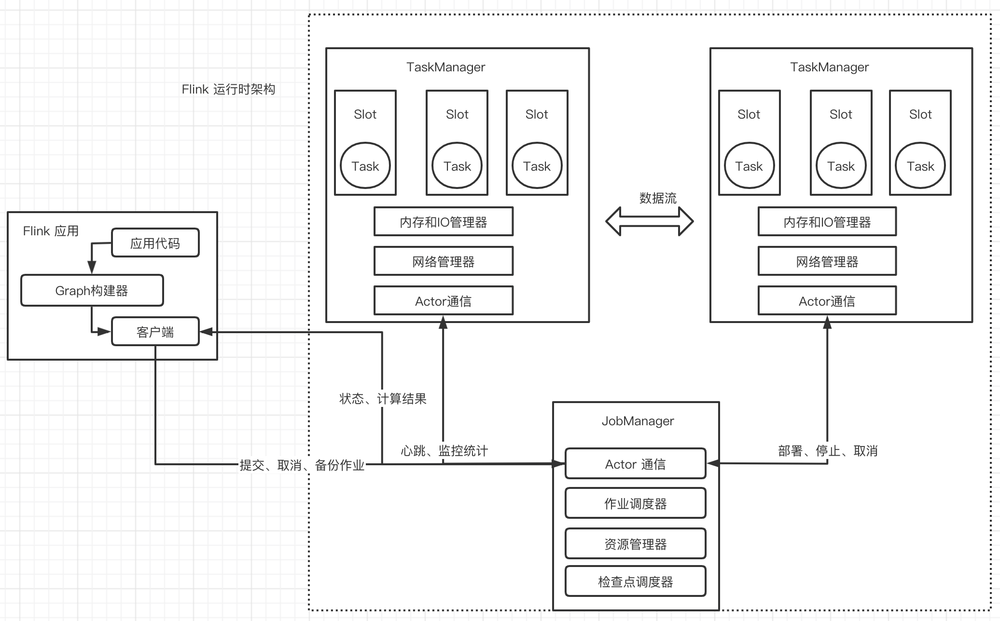
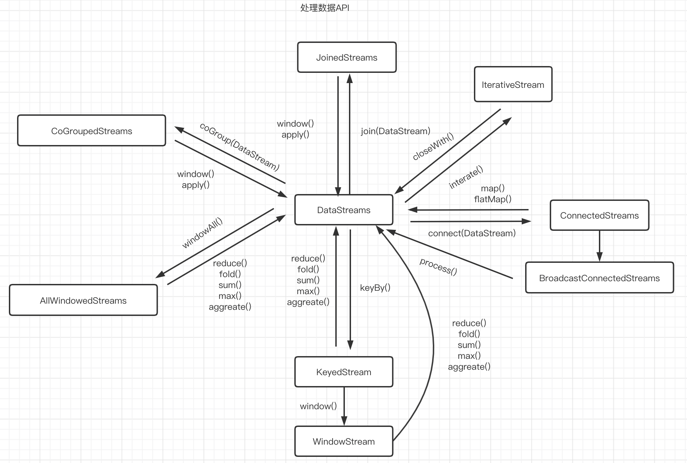
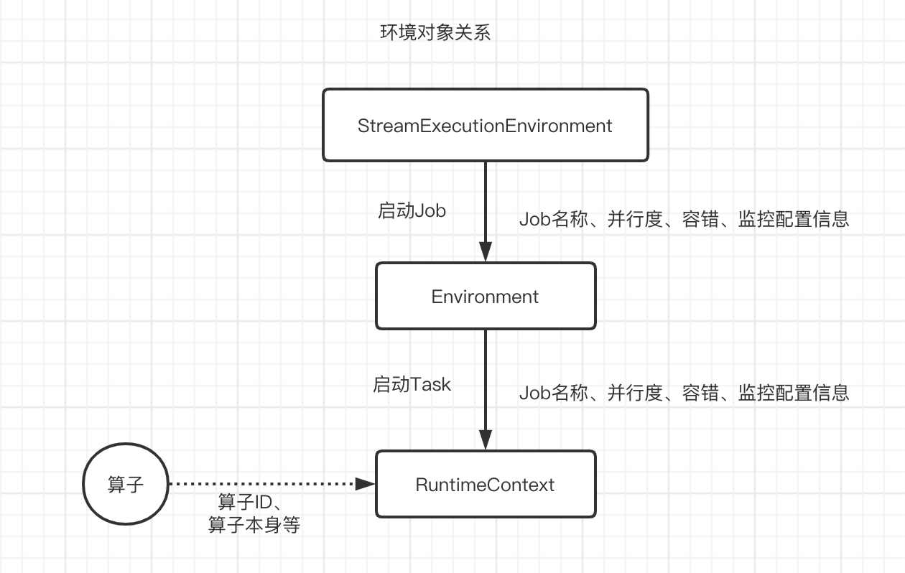
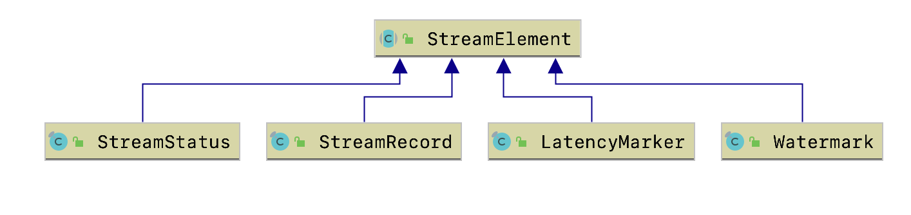
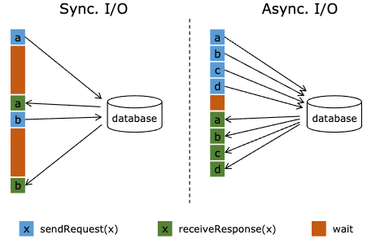
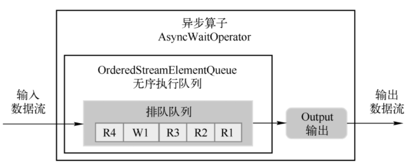
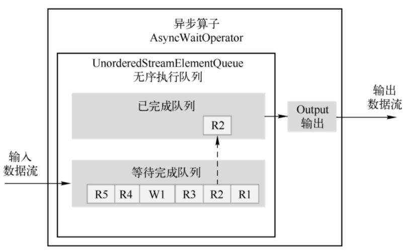

# Flink

## Flink 入门

### Flink 核心特点

#### 批流一体

所有的数据都天然带有时间的概念，必然发生在某一个时间点。把事件按照时间顺序排列起来，就形成了一个事件流，也叫作数据流。**无界数据**是持续产生的数据，所以必须持续地处理无界数据流。**有界数据**，就是在一个确定的时间范围内的数据流，有开始有结束，一旦确定了就不会再改变。

#### 可靠的容错能力

- 集群级容错
  - 集群管理器集成（Hadoop YARN、Mesos或Kubernetes）
  - 高可用性设置（HA模式基于ApacheZooKeeper）
- 应用级容错（ Checkpoint）
  - 一致性（其本身支持Exactly-Once 语义）
  - 轻量级（检查点的执行异步和增量检查点）
- 高吞吐、低延迟

#### 运行时架构

- Flink 客户端
  - 提交Flink作业到Flink集群
  - Stream Graph 和 Job Graph构建
- JobManager
  - 资源申请
  - 任务调度
  - 应用容错
- TaskManager
  - 接收JobManager 分发的子任务，管理子任务
  - 任务处理（消费数据、处理数据）

##  Flink 应用

#### 数据流

##### DataStream 体系

1. DataStream(每个DataStream都有一个Transformation对象)
2. DataStreamSource（DataStream的起点）
3. DataStreamSink（DataStream的输出）
4. KeyedStream（表示根据指定的Key记性分组的数据流）
5. WindowdeStream & AllWindowedStream（根据key分组且基于WindowAssigner切分窗口的数据流）
6. JoinedStreams & CoGroupedStreams
   1. JoinedStreams底层使用CoGroupedStreams来实现
   2. CoGrouped侧重的是Group，对数据进行分组，是对同一个key上的两组集合进行操作
   3. Join侧重的是数据对，对同一个key的每一对元素进行操作
7. ConnectedStreams（表示两个数据流的组合）
8. BroadcastStream & BroadcastConnectedStream（DataStream的广播行为）
9. IterativeStream（包含IterativeStream的Dataflow是一个有向有环图）
10. AsyncDataStream（在DataStream上使用异步函数的能力）

##### 处理数据API

## 核心抽象

### 环境对象

### 数据流元素

1. StreamRecord（数据流中的一条记录｜事件）
   1. 数据的值本身
   2. 时间戳（可选）
2. LatencyMarker（用来近似评估延迟）
   1. 周期性的在数据源算子中创造出来的时间戳
   2. 算子编号
   3. 数据源所在的Task编号
3. Watemark（是一个时间戳，用来告诉算子所有时间早于等于Watermark的事件或记录都已经到达，不会再有比Watermark更早的记录，算子可以根据Watermark触发窗口的计算、清理资源等）
4. StreamStatus（用来通知Task是否会继续接收到上游的记录或者Watermark）
   1. 空闲状态（IDLE）。
   2. 活动状态（ACTIVE）。

###  Flink 异步IO

#### 原理

- 顺序输出模式（先收到的数据元素先输出，后续数据元素的异步函数调用无论是否先完成，都需要等待）

  

- 无序输出模式（先处理完的数据元素先输出，不保证消息顺序）

  

### 数据分区

- ForwardPartitioner（用于在同一个OperatorChain中上下游算子之间的数据转发，实际上数据是直接传递给下游的）
- ShufflePartitioner（随机将元素进行分区，可以确保下游的Task能够均匀地获得数据）
- ReblancePartitioner（以Round-robin的方式为每个元素分配分区，确保下游的Task可以均匀地获得数据，避免数据倾斜）
- RescalingPartitioner（用Round-robin选择下游的一个Task进行数据分区，如上游有2个Source，下游有6个Map，那么每个Source会分配3个固定的下游Map，不会向未分配给自己的分区写入数据）
- BroadcastPartitioner（将该记录广播给所有分区）
- KeyGroupStreamPartitioner（KeyedStream根据KeyGroup索引编号进行分区，该分区器不是提供给用户来用的）