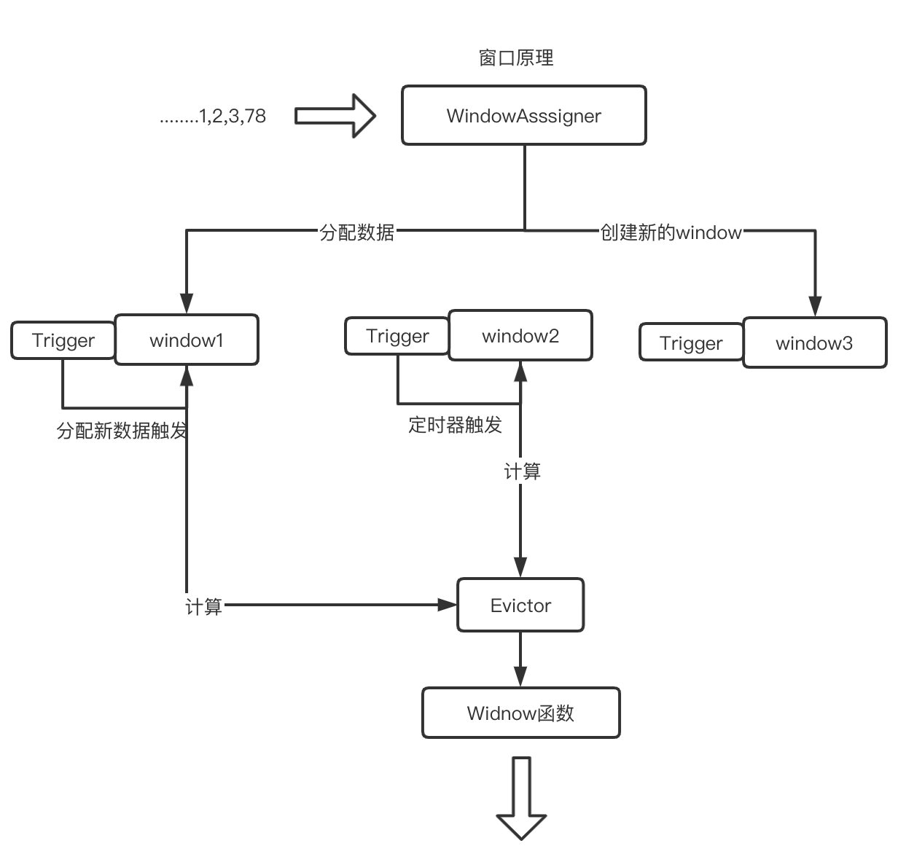
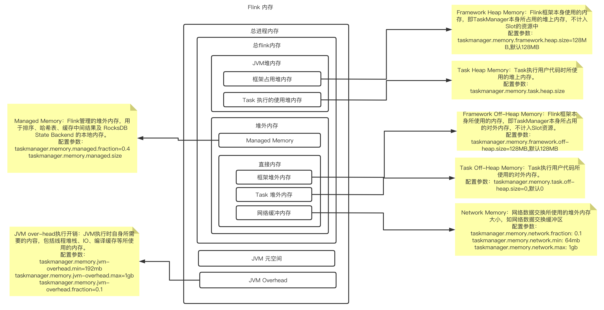
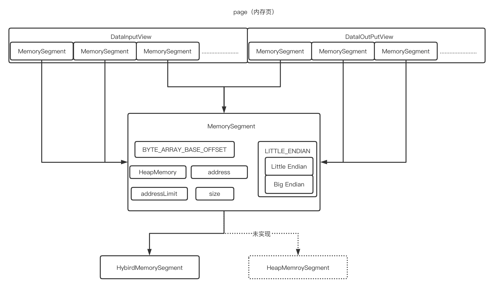
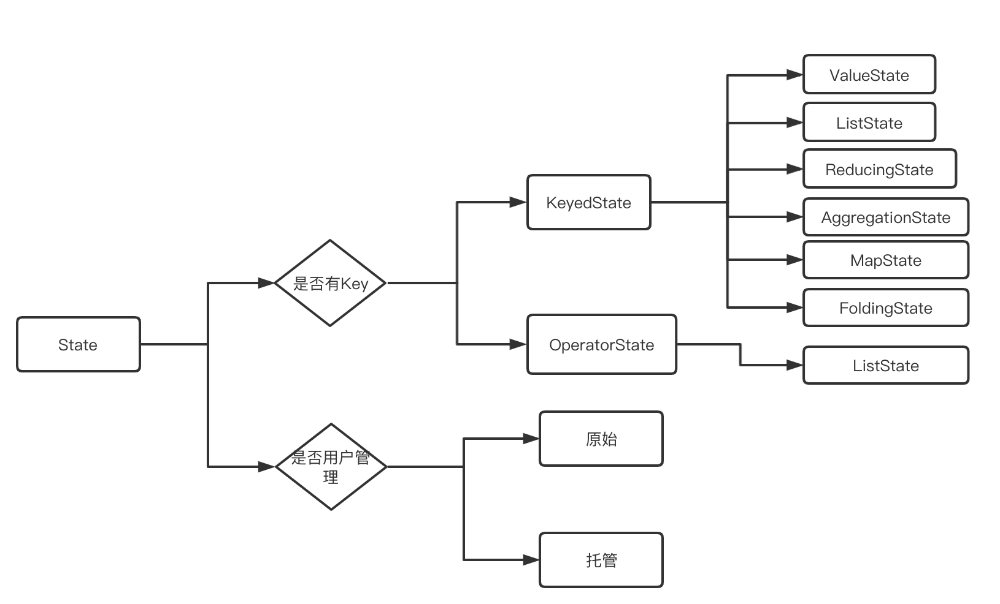
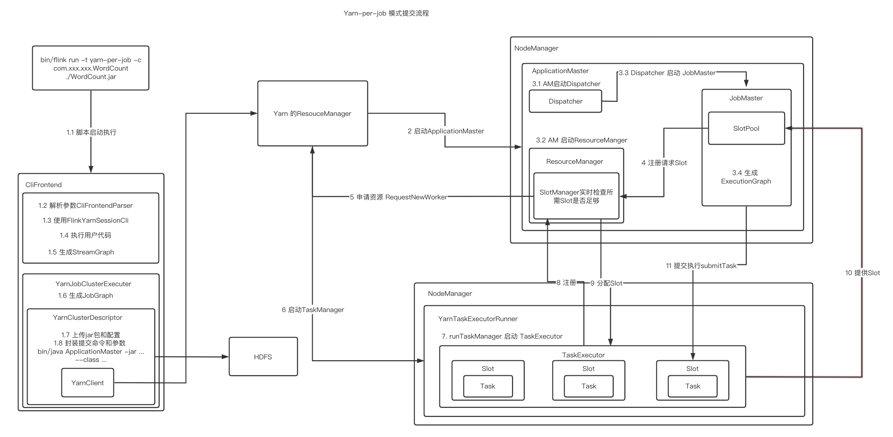
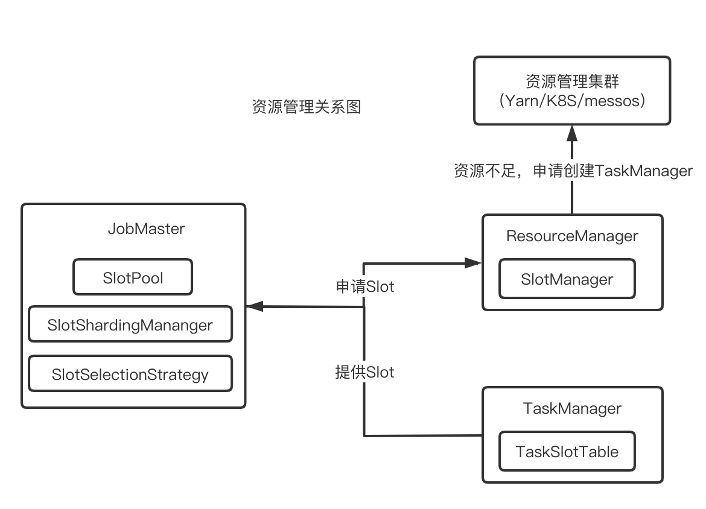
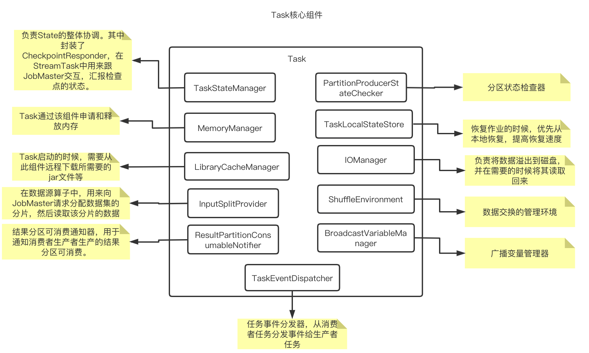

# Flink

## Flink 入门

### Flink 核心特点

#### 批流一体

所有的数据都天然带有时间的概念，必然发生在某一个时间点。把事件按照时间顺序排列起来，就形成了一个事件流，也叫作数据流。**无界数据**是持续产生的数据，所以必须持续地处理无界数据流。**有界数据**，就是在一个确定的时间范围内的数据流，有开始有结束，一旦确定了就不会再改变。

#### 可靠的容错能力

- 集群级容错
  - 集群管理器集成（Hadoop YARN、Mesos或Kubernetes）
  - 高可用性设置（HA模式基于ApacheZooKeeper）
- 应用级容错（ Checkpoint）
  - 一致性（其本身支持Exactly-Once 语义）
  - 轻量级（检查点的执行异步和增量检查点）
- 高吞吐、低延迟

#### 运行时架构

- Flink 客户端
  - 提交Flink作业到Flink集群
  - Stream Graph 和 Job Graph构建
- JobManager
  - 资源申请
  - 任务调度
  - 应用容错
- TaskManager
  - 接收JobManager 分发的子任务，管理子任务
  - 任务处理（消费数据、处理数据）

##  Flink 应用

#### 数据流

##### DataStream 体系

1. DataStream(每个DataStream都有一个Transformation对象)
2. DataStreamSource（DataStream的起点）
3. DataStreamSink（DataStream的输出）
4. KeyedStream（表示根据指定的Key记性分组的数据流）
5. WindowdeStream & AllWindowedStream（根据key分组且基于WindowAssigner切分窗口的数据流）
6. JoinedStreams & CoGroupedStreams
   1. JoinedStreams底层使用CoGroupedStreams来实现
   2. CoGrouped侧重的是Group，对数据进行分组，是对同一个key上的两组集合进行操作
   3. Join侧重的是数据对，对同一个key的每一对元素进行操作
7. ConnectedStreams（表示两个数据流的组合）
8. BroadcastStream & BroadcastConnectedStream（DataStream的广播行为）
9. IterativeStream（包含IterativeStream的Dataflow是一个有向有环图）
10. AsyncDataStream（在DataStream上使用异步函数的能力）

##### 处理数据API

## 核心抽象

### 环境对象

### 数据流元素

1. StreamRecord（数据流中的一条记录｜事件）
   1. 数据的值本身
   2. 时间戳（可选）
2. LatencyMarker（用来近似评估延迟）
   1. 周期性的在数据源算子中创造出来的时间戳
   2. 算子编号
   3. 数据源所在的Task编号
3. Watemark（是一个时间戳，用来告诉算子所有时间早于等于Watermark的事件或记录都已经到达，不会再有比Watermark更早的记录，算子可以根据Watermark触发窗口的计算、清理资源等）
4. StreamStatus（用来通知Task是否会继续接收到上游的记录或者Watermark）
   1. 空闲状态（IDLE）。
   2. 活动状态（ACTIVE）。

###  Flink 异步IO

#### 原理

- 顺序输出模式（先收到的数据元素先输出，后续数据元素的异步函数调用无论是否先完成，都需要等待）

  

- 无序输出模式（先处理完的数据元素先输出，不保证消息顺序）

  

### 数据分区

- ForwardPartitioner（用于在同一个OperatorChain中上下游算子之间的数据转发，实际上数据是直接传递给下游的）
- ShufflePartitioner（随机将元素进行分区，可以确保下游的Task能够均匀地获得数据）
- ReblancePartitioner（以Round-robin的方式为每个元素分配分区，确保下游的Task可以均匀地获得数据，避免数据倾斜）
- RescalingPartitioner（用Round-robin选择下游的一个Task进行数据分区，如上游有2个Source，下游有6个Map，那么每个Source会分配3个固定的下游Map，不会向未分配给自己的分区写入数据）
- BroadcastPartitioner（将该记录广播给所有分区）
- KeyGroupStreamPartitioner（KeyedStream根据KeyGroup索引编号进行分区，该分区器不是提供给用户来用的）

## 窗口

### 实现原理

- WindowAssigner（用来决定某个元素被分配到哪个/哪些窗口中去）
- WindowTrigger（决定一个窗口何时能够呗计算或清除，每一个窗口都拥有一个属于自己的Trigger）
- WindowEvictor（窗口数据的过滤器，可在Window Function 执行前或后，从Window中过滤元素）
  - CountEvictor：计数过滤器。在Window中保留指定数量的元素，并从窗口头部开始丢弃其余元素
  - DeltaEvictor：阈值过滤器。丢弃超过阈值的数据记录
  - TimeEvictor：时间过滤器。保留最新一段时间内的元素

###  Watermark （水印）

#### 作用

用于处理乱序事件，而正确地处理乱序事件，通常用Watermark机制结合窗口来实现

#### DataStream Watermark 生成

1. Source Function 中生成Watermark
2. DataStream API 中生成Watermark
   1. AssingerWithPeriodicWatermarks （周期性的生成Watermark策略，不会针对每个事件都生成）
   2. AssingerWithPunctuatedWatermarks （对每个事件都尝试进行Watermark的生成，如果生成的结果是null 或Watermark小于之前的，则不会发往下游）

## 内存管理

### 自主内存管理

#### 原因

1. JVM内存管理的不足
   1. 有效数据密度低
   2. 垃圾回收（大数据场景下需要消耗大量的内存，更容易触发Full GC ）
   3. OOM 问题影响稳定性
   4. 缓存未命中问题（Java对象在堆上存储时并不是连续的）
2. 自主内存管理
   1. 堆外内存的优势
      1. 大内存（上百GB）JVM的启动需要很长时间，Full GC可以达到分钟级。使用堆外内存，可以将大量的数据保存在堆外，极大地减小堆内存，避免GC和内存溢出的问题。
      2. 高效的IO操作。堆外内存在写磁盘或网络传输时是zero-copy，而堆上内存则至少需要1次内存复制。
      3. 堆外内存是进程间共享的。也就是说，即使JVM进程崩溃也不会丢失数据。这可以用来做故障恢复（Flink暂时没有利用这项功能，不过未来很可能会去做）
   2. 堆外内存的不足
      1. 堆上内存的使用、监控、调试简单，堆外内存出现问题后的诊断则较为复杂
      2. Flink有时需要分配短生命周期的MemorySegment，在堆外内存上分配比在堆上内存开销更高。
      3. 在Flink的测试中，部分操作在堆外内存上会比堆上内存慢

### 内存模型

#### 内存模型图

#### MemorySegment（内存段）

一个MemorySegment对应着一个32KB大小的内存块。这块内存既可以是堆上内存（Java的byte数组），也可以是堆外内存（基于Netty的DirectByteBuffer）

##### 图解

##### 结构

- BYTE_ARRAY_BASE_OFFSET（二进制字节数组的起始索引）
- LITTLE_ENDIAN（判断是否为Little Endian模式的字节存储顺序，若不是，就是Big Endian模式）
  - Big Endian：低地址存放最高有效字节（MSB）
  - Little Endian：低地址存放最低有效字节（LSB）X86机器
- HeapMemory（如果MemeorySegment使用堆上内存，则表示一个堆上的字节数组（byte［］），如果MemorySegment使用堆外内存，则为null）
- address（字节数组对应的相对地址）
- addressLimit（标识地址结束位置）
- size（内存段的字节数）

##### 实现

- HybirdMemorySegment：用来分配堆上和堆外内存和堆上内存，Flink 在实际使用中只使用了改方式。原因是当有多个实现时，JIT无法直接在编译时自动识别优化
- HeapMemorySegment：用来分配堆上内存，实际没有实现

#### MemroyManager（内存管理器）

实际申请的是堆外内存，通过RocksDB的Block Cache和WriterBufferManager参数来限制，RocksDB使用的内存量

## State（状态）

状态管理需要考虑的因素：

1. 状态数据的存储和访问
2. 状态数据的备份和恢复
3. 状态数据的划分和动态扩容
4. 状态数据的清理

### 分类

### 状态存储

- MemoryStateBackend：纯内存，适用于验证、测试，不推荐生产环境
- FsStateBackend：内存+文件，适用于长周期大规模的数据
- RocksDBStateBackend：RocksDB，适用于长周期大规模的数据

### 重分布

- ListState：并行度在改变的时候，会将并发上的每个List都取出，然后把这些List合并到一个新的List,根据元素的个数均匀分配给新的Task
- UnionListState:把划分的方式交给用户去做，当改变并发的时候，会将原来的List拼接起来，然后不做划分，直接交给用户
- BroadcastState:变并发的时候，把这些数据分发到新的Task即可
- KeyState：Key-Group数量取决于最大并行度（MaxParallism）

## 作业提交

## 资源管理

### 关系图

### Slot选择策略

- LocationPreferenceSlotSelectionStrategy（位置优先的选择策略）
  - DefaultLocationPreferenceSlotSelectionStrategy（默认策略），该策略不考虑资源的均衡分配，会从满足条件的可用Slot集合选择第1个
  - EvenlySpreadOutLocationPreferenceSlotSelectionStrategy（均衡策略），该策略考虑资源的均衡分配，会从满足条件的可用Slot集合中选择剩余资源最多的Slot，尽量让各个TaskManager均衡地承担计算压力
- PreviousAllocationSlotSelectionStrategy（已分配Slot优先的选择策略），如果当前没有空闲的已分配Slot，则仍然会使用位置优先的策略来分配和申请Slot

## 调度

- SchedulerNG （调度器）

  - 作用
    1. 作业的生命周期管理（开始调度、挂起、取消）
    2. 作业执行资源的申请、分配、释放
    3. 作业状态的管理（发布过程中的状态变化、作业异常时的FailOver
    4. 作业的信息提供，对外提供作业的详细信息
  - 实现
    1. DefaultScheduler（使用ScchedulerStrategy来实现）
    2. LegacyScheduler（实际使用了原来的ExecutionGraph的调度逻辑）

- SchedulingStrategy（调度策略）

  1. startScheduling：调度入口，触发调度器的调度行为
  2. restartTasks：重启执行失败的Task，一般是Task执行异常导致的
  3. onExecutionStateChange：当Execution的状态发生改变时
  4. onPartitionConsumable：当IntermediateResultParitititon中的数据可以消费时

  - 实现
    1. EagerSchelingStrategy（该调度策略用来执行流计算作业的调度）
    2. LazyFromSourceSchedulingStrategy（该调度策略用来执行批处理作业的调度）

- ScheduleMode（调度模式）

  1. Eager调度（该模式适用于流计算。一次性申请需要所有的资源，如果资源不足，则作业启动失败。）
  2. Lazy_From_Sources分阶段调度（适用于批处理。从Source Task开始分阶段调度，申请资源的时候，一次性申请本阶段所需要的所有资源。上游Task执行完毕后开始调度执行下游的Task，读取上游的数据，执行本阶段的计算任务，执行完毕之后，调度后一个阶段的Task，依次进行调度，直到作业执行完成）
  3. Lazy_From_Sources_With_Batch_Slot_Request分阶段Slot重用调度（适用于批处理。与分阶段调度基本一样，区别在于该模式下使用批处理资源申请模式，可以在资源不足的情况下执行作业，但是需要确保在本阶段的作业执行中没有Shuffle行为）

### 关键组件

#### JobMaster

1. 调度执行和管理（将JobGraph转化为ExecutionGraph，调度Task的执行，并处理Task的异常）
   - InputSplit 分配
   - 结果分区跟踪
   - 作业执行异常
2. 作业Slot资源管理
3. 检查点与保存点
4. 监控运维相关
5. 心跳管理

#### Task

结构

