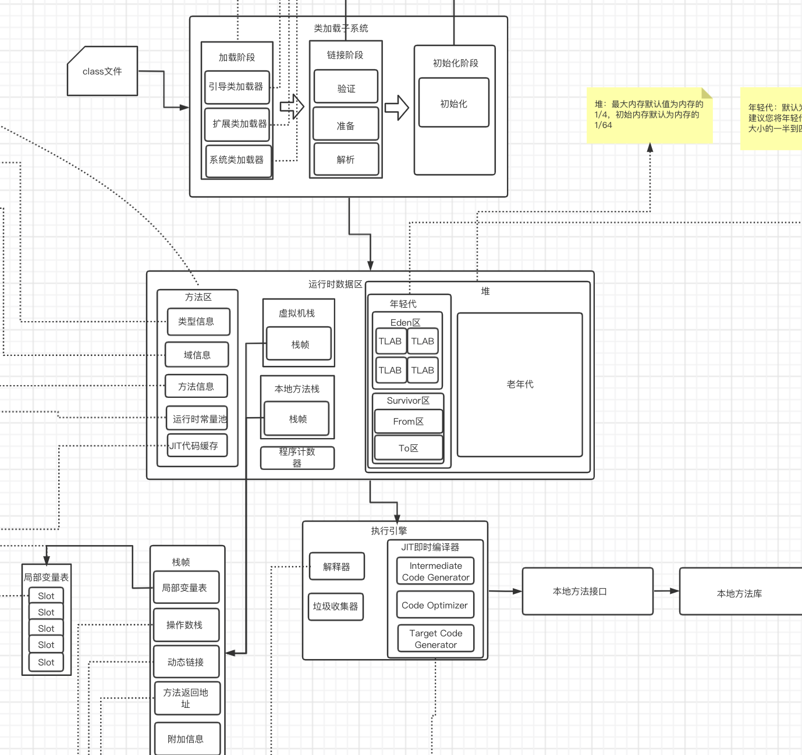
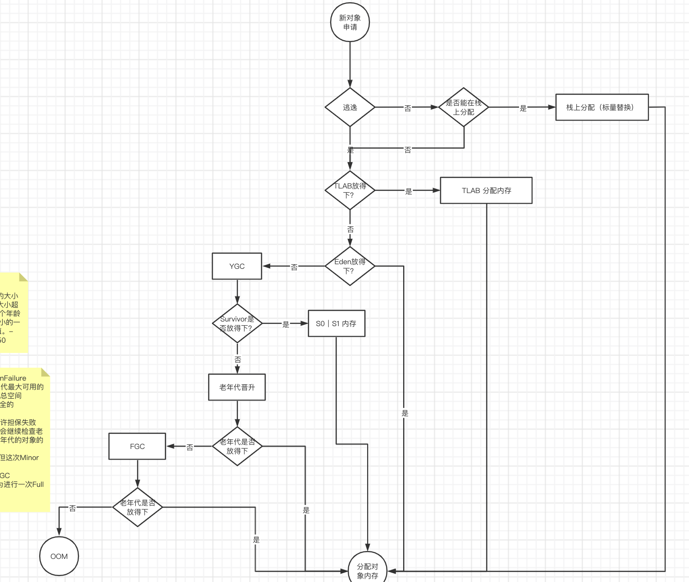

## 图解

#### 内存结构

#### 对象创建

GC:
 确定垃圾的规则：引用计数法、可达性分析
 GC算法：复制算法、标记清除、标记压缩、标记整理、分代收集算法
 垃圾回收器：Serial、ParNew、Parallel Scavenge、Serial Old 、Parallel old 、CMS、G1

TLAB:
动态年龄机制：如果在Survivor空间中相同年龄所有对象大小的总和大于Survivor空间的一半（动态年龄判断），年龄大于或等于该年龄的对象就可以直接进入老年代，无须等到MaxTenuringThreshold中要求的年龄
空间内存担保：在发生Minor GC之前，虚拟机会检查老年代最大可用的连续空间是否大于新生代所有对象的总空间，

GCRoots的对象:
	虚拟机栈(栈帧中的局部变量区,也叫做局部变量表
	方法区中的类静态属性引用的对象。
	方法区中常量引用的对象
	本地方法栈中N( Native方法)引用的对象
内存诊断工具：
	jmap -heap <pid> 查看堆内存信息
	jstat  -options 显示统计信息
	jstack	查看栈信息和死锁信息