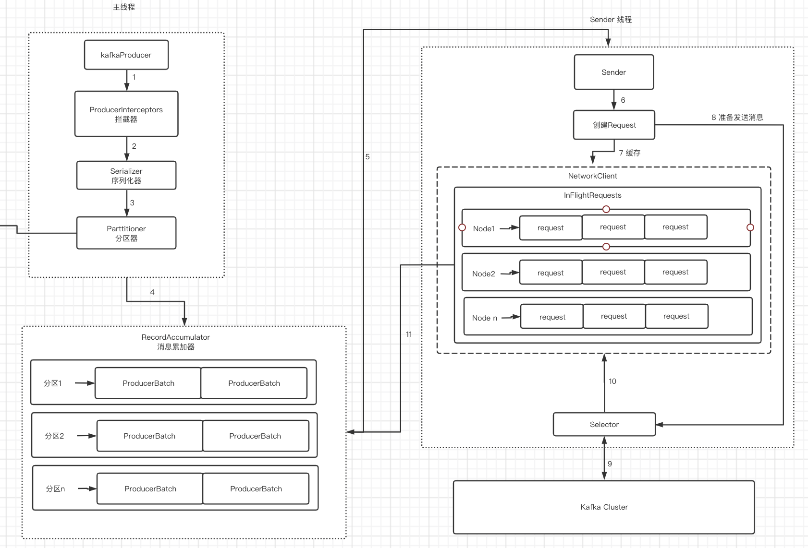

名词解释

- Producer：生产者，也就是发送消息的一方。生产者负责创建消息，然后将其投递到Kafka中。
- Consumer：消费者，也就是接收消息的一方。消费者连接到Kafka上并接收消息，进而进行相应的业务逻辑处理。
- Broker：服务代理节点。对于Kafka而言，Broker可以简单地看作一个独立的Kafka服务节点或Kafka服务实例。
- Topic：Kafka中的消息以主题为单位进行归类，生产者负责将消息发送到特定的主题（发送到Kafka集群中的每一条消息都要指定一个主题），而消费者负责订阅主题并进行消费。
- Partition：主题是一个逻辑上的概念，它还可以细分为多个分区，一个分区只属于单个主题，很多时候也会把分区称为主题分区（Topic-Partition
- Offset：同一主题下的不同分区包含的消息是不同的，分区在存储层面可以看作一个可追加的日志（Log）文件，消息在被追加到分区日志文件的时候都会分配一个特定的偏移量。offset是消息在分区中的唯一标识，Kafka通过它来保证消息在分区内的顺序性，不过offset并不跨越分区，也就是说，Kafka保证的是分区有序而不是主题有序。
- Replica：Kafka 为分区引入了多副本（Replica）机制，通过增加副本数量可以提升容灾能力。
- Leader：副本之间是“一主多从”的关系，其中leader副本负责处理读写请求.
- Follower：follower副本只负责与leader副本的消息同步
- AR（Assigned Replicas）：分区中的所有副本
- ISR（In-Sync Replicas）：所有与leader副本保持一定程度同步的副本（包括leader副本在内）组成ISR（In-Sync Replicas），ISR集合是AR集合中的一个子集
- OSR（Out-of-Sync Replicas）：与leader副本同步滞后过多的副本（不包括leader副本）
- HW（High Watermark）：俗称高水位，它标识了一个特定的消息偏移量（offset），消费者只能拉取到这个offset之前的消息。
- LEO（Log End Offset）：它标识当前日志文件中下一条待写入消息的offset

## 发送者过程

## 存储结构

### 分区分配策略：

​		1.RangeAssignor分配策略
​		2.RoundRobinAssignor分配策略
​		3.StickyAssignor分配策略

### 消费者协调器和组协调器：

​		全部消费组分成多个子集，每个消费组的子集在服务端对应一个GroupCoordinator对其进行管理，GroupCoordinator是Kafka服务端中用于管理消费组的组件
​		而消费者客户端中的ConsumerCoordinator组件负责与GroupCoordinator进行交互

### 再均衡的操作：	

​			1.有新的消费者加入消费组
​			2.有消费者宕机下线
​			3.有消费者主动退出消费组
​			4.消费组所对应的GroupCoorinator节点发生了变更。
​			5.消费组内所订阅的任一主题或者主题的分区数量发生变化。

### 消息传输保障：

​		1.at most once: 至多一次，消息有可能丢失，但是绝对不会重复传输
​		2.at least once：最少一次，消息绝对不会丢失，但是可能会重复传输
​		3.exactly once： 恰好一次，每条消息肯定会被传输一次且仅传输一次

### 事务：

​	initTransactions:初始化事务
​	beginTranscation：开启事务
​	sendOffsetsToTransaction: 事务内的位移提交操作
​	commitTransaction：提交事务
​	abortTransaction：中止事务