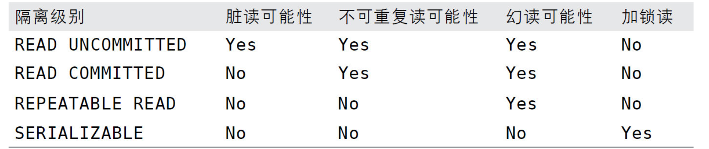

## Explain

​		id
​		select_type:查询的类型，主要是用于区别普通查询、联合查询、子查询等的复杂查询
​		table
​		type: 显示查询使用了何种类型，从最好到最差依次是：system>const>eq_ref>ref>range>index>ALL
​		possible_keys:显示可能应用在这张表中的索引，一个或多个。查询涉及到的字段上若存在索引，则该索引将被列出，但不一定被查询实际使用
​		key:查询中若使用了覆盖索引，则该索引和查询的select字段重叠
​		key_len:key_len字段能够帮你检查是否充分的利用上了索引
​		ref:显示索引的哪一列被使用了，如果可能的话，是一个常数。哪些列或常量被用于查找索引列上的值
​		rows:rows列显示MySQL认为它执行查询时必须检查的行数。

## 引擎

|      引擎      |   MYISAM   |       INNODB       |
| :------------: | :--------: | :----------------: |
|      外键      |   不支持   |        支持        |
|      事务      |   不支持   |        支持        |
|       锁       |    表锁    |        行锁        |
|      缓存      | 只缓存索引 | 缓存索引和真实数据 |
|     关注点     |  读取性能  |    并发写、事务    |
|    默认安装    |     是     |         是         |
|    默认使用    |     否     |         是         |
| 自带系统表使用 |     是     |         否         |

## 索引

普通索引
唯一索引
主键索引
组合索引
全文索引

## 事务

特性(ACID)：
	原子性：操作不可再分
	一致性：如果一个事务原子地在一个一致地数据库中独立运行，那么在它执行之后，数据库的状态一定是一致的
	隔离性：保证事务的独立和完整
	持久性：事务被提交，那么数据一定会被写入到数据库中并持久存储起来
CAP:一致性、可用性、分区容错性

#### 隔离级别

- READ UNCMMITED （未提交读）:事务中的修改即使没有提交，对其他事务也都是可见的。读取未提交的数据，被称为脏读（Dirty Read）
- READ COMMITED（提交读）：大多数的数据库系统的默认隔离级别都是READ COMMITED （但MYSQL 不是）。从事务开始前知道事务提交之前，所做的任何修改对其他事务都是不可见的。这个级别有时候有时候也叫做不可重复读（nonrepeatable read），因为两次执行同样的查询，可能会得到不同的结果。
- REPEATABLE READ （可重复读）：同一个事务中多次读取同样记录的结果是一致的，但是理论上，可重复读隔离级别还是无法解决另外一个幻读（Phantom Read）的问题；所谓幻读，指的是当某个事务在读取某个范围内的记录时，另外一个事务又在该范围内插入了新的记录，当之前的事务再次读取该范围的记录时，会产生幻行（Phantom Row）。InnoDB和XtraDB存储引擎通过多版本并发控制（MVCC，Multiversion Concurrency Control）解决了幻读的问题
- SERIALIZABLE 最高的隔离级别。它通过强制事务串行执行，避免了前面说的幻读的问题。简单来说，SERIALIZABLE会在读取的每一行数据上都加锁，所以可能导致大量的超时和锁争用的问题。实际应用中也很少用到这个隔离级别，只有在非常需要确保数据的一致性而且可以接受没有并发的情况下，才考虑采用该级别

#### 死锁

死锁是指两个或者多个事务在同一资源上相互占用，并请求锁定对方占用的资源，从而导致恶性循环的现象。

#### 多版本并发控制（MVCC）

MVCC是行级锁的一个变种，但是它在很多情况下避免了加锁操作，因此开销更低。虽然实现机制有所不同，但大都实现了非阻塞的读操作，写操作也只锁定必要的行。MVCC的实现，是通过保存数据在某个时间点的快照来实现的。也就是说，不管需要执行多长时间，每个事务看到的数据都是一致的。根据事务开始的时间不同，每个事务对同一张表，同一时刻看到的数据可能是不一样的。

### MYSQL的存储引擎

#### 