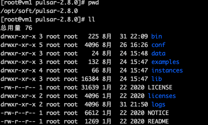
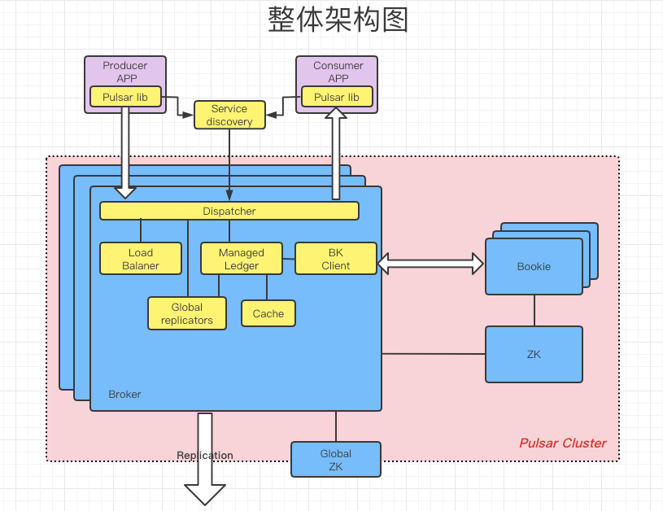
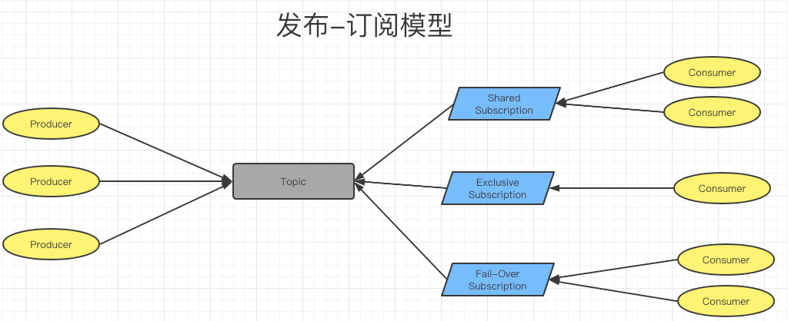
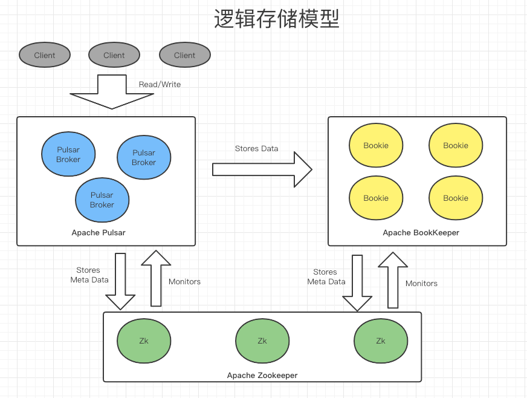
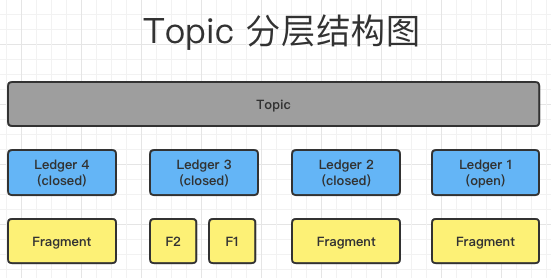
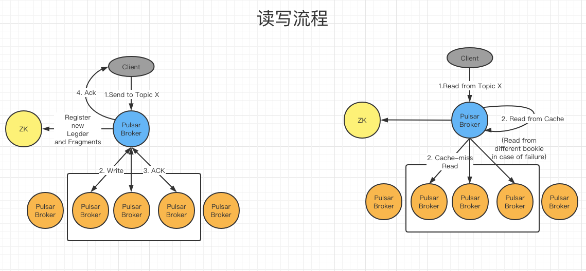

# Pulsar

## 1. 简介

​	Apache Pulsar 是灵活的**发布-订阅消息系统**（Flexible Pub/Sub messaging），采用**分层分片架构**。

### 1.1 特性

#### 1.1.1 发布-订阅消息系统

关于发布-订阅模型的概念，主要从多租户、灵活的消息系统、云原生构架、分片的流（Segmented Streams）等方面来强调 Apache Pulsar 的功能和特性。

#### 1.1.2 多租户

租户和命名空间（namespace）是 Pulsar 支持多租户的两个核心概念

- 在租户级别，Pulsar 为特定的租户预留合适的存储空间、应用授权与认证机制。
- 在命名空间级别，Pulsar 有一系列的配置策略（policy），包括存储配额、流控、消息过期策略和命名空间之间的隔离策略。

#### 1.1.3 灵活的消息系统

Pulsar 做了队列模型和流模型的统一，在 Topic 级别只需保存一份数据，同一份数据可多次消费。以流式、队列等方式计算不同的订阅模型大大提升了灵活度。

#### 1.1.4 云原生架构

Pulsar 使用计算与存储分离的云原生架构，数据从 Broker 搬离，存在共享存储内部。上层是无状态 Broker，复制消息分发和服务；下层是持久化的存储层 Bookie 集群。Pulsar 存储是分片的，这种构架可以避免扩容时受限制，实现数据的独立扩展和快速恢复。

#### 1.1.5 Segmented Streams

Pulsar 将无界的数据看作是分片的流，分片分散存储在分层存储（tiered storage）、BookKeeper 集群和 Broker 节点上，而对外提供一个统一的、无界数据的视图。其次，不需要用户显式迁移数据，减少存储成本并保持近似无限的存储。


## 2. 案例实操演示

### 2.1 目录介绍



| 文件夹    | 说明                                                         |
| --------- | ------------------------------------------------------------ |
| bin       | 命令行工具，例如：pulsar 、pulsar-daemo、pulsar-admin、pulsar-client |
| conf      | 配置文件，例如：broker configuration、Zookeeper configuration |
| data      | 数据存储文件夹，主要包含Zookeeper 和 BookKeeper              |
| examples  | Jar 包，Pulsar functions 函数的案例                          |
| instances | Pulsar functions 目录                                        |
| lib       | Pulsar jar 包文件                                            |
| licenses  | 许可证文件，用于Pulsar代码库的各种组件                       |
| logs      | 日志文件夹                                                   |

### 2.2 Standalone 模式部署

1. 启动单机Pulsar

   ```shell
   ./bin/pulsar standalone #前台启动
   ./bin/pulsar-daemon start standalone #后台启动
   ```

2. 启动一个消费者

   ```shell
   pulsar-client consume my-topic -s "first-subscription"
   ```

3. 启动一个生产者并发送一条消息

   ```shell
   pulsar-client produce my-topic --messages "hello-pulsar"
   ```

### 2.3 Cluster 模式部署

#### 2.3.1 部署Zookeeper 集群

非重点忽略

#### 2.3.2 初始化 Pulsar cluster 集群元数据

```shell
bin/pulsar initialize-cluster-metadata \
  --cluster pulsar-cluster-1 \
  --zookeeper 192.168.119.2:2181 \
  --configuration-store 192.168.119.2:2181 \
  --web-service-url http://192.168.119.2:8080 \
  --web-service-url-tls https://192.168.119.2:8443 \
  --broker-service-url pulsar://192.168.119.2:6650 \
  --broker-service-url-tls pulsar+ssl://192.168.119.2:6651
```

#### 2.3.3 配置Bookeeper 集群

详情查看附录 ：BookKeeper 集群配置文件

#### 2.3.4 启动并验证 Bookeeper 集群

```shell
bin/bookkeeper shell metaformat # init
bin/pulsar-daemon start bookie # start
bin/bookkeeper shell bookiesanity # 验证
```

#### 2.3.5 配置 Broker

详情查看附录 ：Broker 集群配置文件

#### 2.3.6 启动 Brokers 并验证 Pulsar 集群

```shell
bin/pulsar-daemon start broker # start
bin/pulsar-client produce my-topic --messages "hello-pulsar" # Send message
bin/pulsar-client consume my-topic -s "first-subscription" # consume message	
```

## 3. 架构

### 3.1 整体架构图



#### 3.1.1 Broker

- Http 服务器： 公开REST接口管理和Topic查询
- 调度器： 处理Pulsar传输的所有消息

#### 3.1.2 managed ledger

​	消息流的抽象，有一个写入器进程不断在流结尾添加消息，并且有多个cursors 消费这个流，每个cursor有自己的消费位置。在内部，单个managed ledger使用多个 BookKeeper 分类帐来存储数据。

#### 3.1.3 Pulsar Cluster

- 一个或者多个Pulsar brokers
- 一个ZooKeeper协调器，用于集群级别的配置和协调
- 一组BookKeeper的Bookies用于消息的持久化存储

### 3.2 发布订阅模型图



#### 3.2.1 Subscription

- Shared(共享) : 一个订阅中同时可以有多个消费者，多个消费者共享Topic中的消息
- Exclusive(独享) : 一个订阅只能有一个消息者消费消息
- Fail-Over(灾备) : 一个订阅同时只有一个消费者，可以有多个备份消费者。一旦主消. 费者故障则备份消费者接管。不会出现同时有两个活跃的消费者。

### 3.3 逻辑存储模型图



### 3.4 Topic 结构图



#### 3.4.1 简介

​	一个Topic实际上是一个ledgers流。Ledgers追加到一个Topic，条目(消息或者一组消息)追加到Ledgers。Ledger一旦关闭是不可变的。Ledger作为最小的删除单元，也就是说我们不能删除单个条目而是去删除整个Ledger。Ledgers本身也被分解为多个Fragment。Fragment是BookKeeper集群中最小的分布单元。

​	Topic是Pulsar中的概念。Ledger和Fragment是BookKeeper中的概念，尽管Pulsar知道且使用Ledgers和Fragment。

#### 3.4.2 重要参数

- #### Ensemble Size (E) : 创建Ledger 时使用的Brokie的数量

- #### Write Quorum Size (QW)：每条消息存储的副本的数量

- #### Ack Quorum Size (Qa) : 消息复制成功的ACK 数量

### 3.5 读写流程图



## 4. Pulsar Funtion & IO 

### 4.1 简介

**Pulsar Functions** 是轻量级计算流程，具有以下特点：

- 从一个或多个 Pulsar topic 中消费消息；

- 将用户提供的处理逻辑应用于每条消息；

- 将运行结果发布到另一个 topic。

  

**Pulsar IO** 包含了Source 和 Sink 提供了Pulsar 和外部组件进行对接的能力，使之能够轻松同外部系统结合使用


### 4.2 案例

#### 4.2.1 Function Case

```shell
bin/pulsar-admin functions create \
  --jar ./examples/api-examples.jar \
  --classname org.apache.pulsar.functions.api.examples.WordCountFunction \
  --tenant public \
  --namespace default \
  --name word-count \
  --inputs persistent://public/default/sentences \
  --output persistent://public/default/count
```


#### 4.2.2 IO Case

1. 创建配置文件

   ```yaml
   # create source-kafka.yaml
   configs:
      bootstrapServers: "192.168.119.2:9092"
      groupId: "test-pulsar-io"
      topic: "test_topic"
      sessionTimeoutMs: "10000"
      autoCommitEnabled: "false
   ```

2. 下载以来包

   ```
   pulsar-io-kafka-2.8.0.nar
   kafka-clients-2.8.0.jar
   ```

3. 启动Sources

   ```shell
   ./bin/pulsar-admin source create \
   --archive ./lib/pulsar-io-kafka-2.8.0.nar \
   --classname org.apache.pulsar.io.kafka.KafkaBytesSource \
   --tenant jiayue-tenant \
   --namespace dplus \
   --name kafka \
   --destination-topic-name my-topic \
   --source-config-file ./instances/kafka/kafka-source-config.yaml \
   --parallelism 1
   ```

4. 客户端查看

   ```shell
   pulsarctl sources list --tenant jiayue-tenant --namespace dplus
   ```

### 4.3 问题

- 异常信息&解决

  ```tex
  异常日志：
  11:16:32.878 [pulsar-web-40-4] WARN  org.eclipse.jetty.server.HttpChannelState - unhandled due to prior sendError
  javax.servlet.ServletException: javax.servlet.ServletException: java.lang.UnsupportedOperationException: Pulsar Function Worker is not enabled, probably functionsWorkerEnabled is set to false
  	at org.eclipse.jetty.server.handler.HandlerCollection.handle(HandlerCollection.java:162) ~[org.eclipse.jetty-jetty-server-9.4.42.v20210604.jar:9.4.42.v20210604]
  	at org.eclipse.jetty.server.handler.StatisticsHandler.handle(StatisticsHandler.java:179) ~[org.eclipse.jetty-jetty-server-9.4.42.v20210604.jar:9.4.42.v20210604]
  	at org.eclipse.jetty.server.handler.HandlerWrapper.handle(HandlerWrapper.java:127) ~[org.eclipse.jetty-jetty-server-9.4.42.v20210604.jar:9.4.42.v20210604]
  	at org.eclipse.jetty.server.Server.handle(Server.java:516) ~[org.eclipse.jetty-jetty-server-9.4.42.v20210604.jar:9.4.42.v20210604]
  	at org.eclipse.jetty.server.HttpChannel.lambda$handle$1(HttpChannel.java:388) ~[org.eclipse.jetty-jetty-server-9.4.42.v20210604.jar:9.4.42.v20210604]
  	at org.eclipse.jetty.server.HttpChannel.dispatch(HttpChannel.java:633) ~[org.eclipse.jetty-jetty-server-9.4.42.v20210604.jar:9.4.42.v20210604]
  	at org.eclipse.jetty.server.HttpChannel.handle(HttpChannel.java:380) [org.eclipse.jetty-jetty-server-9.4.42.v20210604.jar:9.4.42.v20210604]
  	at org.eclipse.jetty.server.HttpConnection.onFillable(HttpConnection.java:277) [org.eclipse.jetty-jetty-server-9.4.42.v20210604.jar:9.4.42.v20210604]
  	at org.eclipse.jetty.io.AbstractConnection$ReadCallback.succeeded(AbstractConnection.java:311) [org.eclipse.jetty-jetty-io-9.4.42.v20210604.jar:9.4.42.v20210604]
  	at org.eclipse.jetty.io.FillInterest.fillable(FillInterest.java:105) [org.eclipse.jetty-jetty-io-9.4.42.v20210604.jar:9.4.42.v20210604]
  	at org.eclipse.jetty.io.ChannelEndPoint$1.run(ChannelEndPoint.java:104) [org.eclipse.jetty-jetty-io-9.4.42.v20210604.jar:9.4.42.v20210604]
  	at org.eclipse.jetty.util.thread.strategy.EatWhatYouKill.runTask(EatWhatYouKill.java:338) [org.eclipse.jetty-jetty-util-9.4.42.v20210604.jar:9.4.42.v20210604]
  	at org.eclipse.jetty.util.thread.strategy.EatWhatYouKill.doProduce(EatWhatYouKill.java:315) [org.eclipse.jetty-jetty-util-9.4.42.v20210604.jar:9.4.42.v20210604]
  	at org.eclipse.jetty.util.thread.strategy.EatWhatYouKill.tryProduce(EatWhatYouKill.java:173) [org.eclipse.jetty-jetty-util-9.4.42.v20210604.jar:9.4.42.v20210604]
  	at org.eclipse.jetty.util.thread.strategy.EatWhatYouKill.run(EatWhatYouKill.java:131) [org.eclipse.jetty-jetty-util-9.4.42.v20210604.jar:9.4.42.v20210604]
  	at org.eclipse.jetty.util.thread.ReservedThreadExecutor$ReservedThread.run(ReservedThreadExecutor.java:383) [org.eclipse.jetty-jetty-util-9.4.42.v20210604.jar:9.4.42.v20210604]
  	at java.util.concurrent.ThreadPoolExecutor.runWorker(ThreadPoolExecutor.java:1149) [?:1.8.0_301]
  	at java.util.concurrent.ThreadPoolExecutor$Worker.run(ThreadPoolExecutor.java:624) [?:1.8.0_301]
  	at io.netty.util.concurrent.FastThreadLocalRunnable.run(FastThreadLocalRunnable.java:30) [io.netty-netty-common-4.1.63.Final.jar:4.1.63.Final]
  	at java.lang.Thread.run(Thread.java:748) [?:1.8.0_301]
  Caused by: javax.servlet.ServletException: java.lang.UnsupportedOperationException: Pulsar Function Worker is not enabled, probably functionsWorkerEnabled is set to false
  	at org.glassfish.jersey.servlet.WebComponent.serviceImpl(WebComponent.java:410) ~[org.glassfish.jersey.containers-jersey-container-servlet-core-2.34.jar:?]
  	at org.glassfish.jersey.servlet.WebComponent.service(WebComponent.java:346) ~[org.glassfish.jersey.containers-jersey-container-servlet-core-2.34.jar:?]
  	at org.glassfish.jersey.servlet.ServletContainer.service(ServletContainer.java:366) ~[org.glassfish.jersey.containers-jersey-container-servlet-core-2.34.jar:?]
  	at org.glassfish.jersey.servlet.ServletContainer.service(ServletContainer.java:319) ~[org.glassfish.jersey.containers-jersey-container-servlet-core-2.34.jar:?]
  	at org.glassfish.jersey.servlet.ServletContainer.service(ServletContainer.java:205) ~[org.glassfish.jersey.containers-jersey-container-servlet-core-2.34.jar:?]
  	at org.eclipse.jetty.servlet.ServletHolder.handle(ServletHolder.java:799) ~[org.eclipse.jetty-jetty-servlet-9.4.42.v20210604.jar:9.4.42.v20210604]
  	at org.eclipse.jetty.servlet.ServletHandler$ChainEnd.doFilter(ServletHandler.java:1626) ~[org.eclipse.jetty-jetty-servlet-9.4.42.v20210604.jar:9.4.42.v20210604]
  	at org.apache.pulsar.broker.web.ResponseHandlerFilter.doFilter(ResponseHandlerFilter.java:65) ~[org.apache.pulsar-pulsar-broker-2.8.0.jar:2.8.0]
  	at org.eclipse.jetty.servlet.FilterHolder.doFilter(FilterHolder.java:193) ~[org.eclipse.jetty-jetty-servlet-9.4.42.v20210604.jar:9.4.42.v20210604]
  	at org.eclipse.jetty.servlet.ServletHandler$Chain.doFilter(ServletHandler.java:1601) ~[org.eclipse.jetty-jetty-servlet-9.4.42.v20210604.jar:9.4.42.v20210604]
  	at org.eclipse.jetty.servlet.ServletHandler.doHandle(ServletHandler.java:548) ~[org.eclipse.jetty-jetty-servlet-9.4.42.v20210604.jar:9.4.42.v20210604]
  	at org.eclipse.jetty.server.handler.ScopedHandler.nextHandle(ScopedHandler.java:233) ~[org.eclipse.jetty-jetty-server-9.4.42.v20210604.jar:9.4.42.v20210604]
  	at org.eclipse.jetty.server.session.SessionHandler.doHandle(SessionHandler.java:1624) ~[org.eclipse.jetty-jetty-server-9.4.42.v20210604.jar:9.4.42.v20210604]
  	at org.eclipse.jetty.server.handler.ScopedHandler.nextHandle(ScopedHandler.java:233) ~[org.eclipse.jetty-jetty-server-9.4.42.v20210604.jar:9.4.42.v20210604]
  	at org.eclipse.jetty.server.handler.ContextHandler.doHandle(ContextHandler.java:1435) ~[org.eclipse.jetty-jetty-server-9.4.42.v20210604.jar:9.4.42.v20210604]
  	at org.eclipse.jetty.server.handler.ScopedHandler.nextScope(ScopedHandler.java:188) ~[org.eclipse.jetty-jetty-server-9.4.42.v20210604.jar:9.4.42.v20210604]
  	at org.eclipse.jetty.servlet.ServletHandler.doScope(ServletHandler.java:501) ~[org.eclipse.jetty-jetty-servlet-9.4.42.v20210604.jar:9.4.42.v20210604]
  	at org.eclipse.jetty.server.session.SessionHandler.doScope(SessionHandler.java:1594) ~[org.eclipse.jetty-jetty-server-9.4.42.v20210604.jar:9.4.42.v20210604]
  	at org.eclipse.jetty.server.handler.ScopedHandler.nextScope(ScopedHandler.java:186) ~[org.eclipse.jetty-jetty-server-9.4.42.v20210604.jar:9.4.42.v20210604]
  	at org.eclipse.jetty.server.handler.ContextHandler.doScope(ContextHandler.java:1350) ~[org.eclipse.jetty-jetty-server-9.4.42.v20210604.jar:9.4.42.v20210604]
  	at org.eclipse.jetty.server.handler.ScopedHandler.handle(ScopedHandler.java:141) ~[org.eclipse.jetty-jetty-server-9.4.42.v20210604.jar:9.4.42.v20210604]
  	at org.eclipse.jetty.server.handler.ContextHandlerCollection.handle(ContextHandlerCollection.java:234) ~[org.eclipse.jetty-jetty-server-9.4.42.v20210604.jar:9.4.42.v20210604]
  	at org.eclipse.jetty.server.handler.HandlerCollection.handle(HandlerCollection.java:146) ~[org.eclipse.jetty-jetty-server-9.4.42.v20210604.jar:9.4.42.v20210604]
  	... 19 more
  解决方式：
  functionsWorkerEnabled=true  #修改配置文件 broker.conf
  ```

  

## Message

## 结构

| Component            | Description                                                  |
| :------------------- | :----------------------------------------------------------- |
| Value / data payload | 消息的内容                                                   |
| Key                  | 消息的Key                                                    |
| Properties           | 用户定义的配置                                               |
| Producer name        | 消息生产者的名称，如果不指定使用的是默认的名称               |
| Sequence ID          | 消息序列ID                                                   |
| Publish time         | The timestamp of when the message is published. The timestamp is automatically applied by the producer. |
| Event time           | An optional timestamp attached to a message by applications. For example, applications attach a timestamp on when the message is processed. If nothing is set to event time, the value is `0`. |
| TypedMessageBuilder  | It is used to construct a message. You can set message properties such as the message key, message value with `TypedMessageBuilder`. When you set `TypedMessageBuilder`, set the key as a string. If you set the key as other types, for example, an AVRO object, the key is sent as bytes, and it is difficult to get the AVRO object back on the consumer. |

## 附录

### BookKeeper 集群配置文件

```txt
# Licensed to the Apache Software Foundation (ASF) under one
# or more contributor license agreements.  See the NOTICE file
# distributed with this work for additional information
# regarding copyright ownership.  The ASF licenses this file
# to you under the Apache License, Version 2.0 (the
# "License"); you may not use this file except in compliance
# with the License.  You may obtain a copy of the License at
#
#   http://www.apache.org/licenses/LICENSE-2.0
#
# Unless required by applicable law or agreed to in writing,
# software distributed under the License is distributed on an
# "AS IS" BASIS, WITHOUT WARRANTIES OR CONDITIONS OF ANY
# KIND, either express or implied.  See the License for the
# specific language governing permissions and limitations
# under the License.
#

## Bookie settings

#############################################################################
## Server parameters
#############################################################################

# Port that bookie server listen on
bookiePort=3181

# Directories BookKeeper outputs its write ahead log.
# Could define multi directories to store write head logs, separated by ','.
# For example:
#   journalDirectories=/tmp/bk-journal1,/tmp/bk-journal2
# If journalDirectories is set, bookies will skip journalDirectory and use
# this setting directory.
# journalDirectories=/tmp/bk-journal

# Directory Bookkeeper outputs its write ahead log
# @deprecated since 4.5.0. journalDirectories is preferred over journalDirectory.
journalDirectory=data/bookkeeper/journal

# Configure the bookie to allow/disallow multiple ledger/index/journal directories
# in the same filesystem disk partition
# allowMultipleDirsUnderSameDiskPartition=false

# Minimum safe Usable size to be available in index directory for bookie to create
# Index File while replaying journal at the time of bookie Start in Readonly Mode (in bytes)
minUsableSizeForIndexFileCreation=1073741824

# Set the network interface that the bookie should listen on.
# If not set, the bookie will listen on all interfaces.
# listeningInterface=eth0

# Configure a specific hostname or IP address that the bookie should use to advertise itself to
# clients. If not set, bookie will advertised its own IP address or hostname, depending on the
# listeningInterface and useHostNameAsBookieID settings.
advertisedAddress=192.168.119.2

# Whether the bookie allowed to use a loopback interface as its primary
# interface(i.e. the interface it uses to establish its identity)?
# By default, loopback interfaces are not allowed as the primary
# interface.
# Using a loopback interface as the primary interface usually indicates
# a configuration error. For example, its fairly common in some VPS setups
# to not configure a hostname, or to have the hostname resolve to
# 127.0.0.1. If this is the case, then all bookies in the cluster will
# establish their identities as 127.0.0.1:3181, and only one will be able
# to join the cluster. For VPSs configured like this, you should explicitly
# set the listening interface.
allowLoopback=false

# Interval to watch whether bookie is dead or not, in milliseconds
bookieDeathWatchInterval=1000

# When entryLogPerLedgerEnabled is enabled, checkpoint doesn't happens
# when a new active entrylog is created / previous one is rolled over.
# Instead SyncThread checkpoints periodically with 'flushInterval' delay
# (in milliseconds) in between executions. Checkpoint flushes both ledger
# entryLogs and ledger index pages to disk.
# Flushing entrylog and index files will introduce much random disk I/O.
# If separating journal dir and ledger dirs each on different devices,
# flushing would not affect performance. But if putting journal dir
# and ledger dirs on same device, performance degrade significantly
# on too frequent flushing. You can consider increment flush interval
# to get better performance, but you need to pay more time on bookie
# server restart after failure.
# This config is used only when entryLogPerLedgerEnabled is enabled.
flushInterval=60000

# Allow the expansion of bookie storage capacity. Newly added ledger
# and index dirs must be empty.
# allowStorageExpansion=false

# Whether the bookie should use its hostname to register with the
# co-ordination service(eg: Zookeeper service).
# When false, bookie will use its ip address for the registration.
# Defaults to false.
useHostNameAsBookieID=false

# If you want to custom bookie ID or use a dynamic network address for the bookie,
# you can set this option.
# Bookie advertises itself using bookieId rather than
# BookieSocketAddress (hostname:port or IP:port).
# bookieId is a non empty string that can contain ASCII digits and letters ([a-zA-Z9-0]),
# colons, dashes, and dots.
# For more information about bookieId, see http://bookkeeper.apache.org/bps/BP-41-bookieid/.
# bookieId=

# Whether the bookie is allowed to use an ephemeral port (port 0) as its
# server port. By default, an ephemeral port is not allowed.
# Using an ephemeral port as the service port usually indicates a configuration
# error. However, in unit tests, using an ephemeral port will address port
# conflict problems and allow running tests in parallel.
# allowEphemeralPorts=false

# Whether allow the bookie to listen for BookKeeper clients executed on the local JVM.
# enableLocalTransport=false

# Whether allow the bookie to disable bind on network interfaces,
# this bookie will be available only to BookKeeper clients executed on the local JVM.
# disableServerSocketBind=false

# The number of bytes we should use as chunk allocation for
# org.apache.bookkeeper.bookie.SkipListArena
# skipListArenaChunkSize=4194304

# The max size we should allocate from the skiplist arena. Allocations
# larger than this should be allocated directly by the VM to avoid fragmentation.
# skipListArenaMaxAllocSize=131072

# The bookie authentication provider factory class name.
# If this is null, no authentication will take place.
# bookieAuthProviderFactoryClass=null

#############################################################################
## Garbage collection settings
#############################################################################

# How long the interval to trigger next garbage collection, in milliseconds
# Since garbage collection is running in background, too frequent gc
# will heart performance. It is better to give a higher number of gc
# interval if there is enough disk capacity.
gcWaitTime=900000

# How long the interval to trigger next garbage collection of overreplicated
# ledgers, in milliseconds [Default: 1 day]. This should not be run very frequently
# since we read the metadata for all the ledgers on the bookie from zk
gcOverreplicatedLedgerWaitTime=86400000

# Number of threads that should handle write requests. if zero, the writes would
# be handled by netty threads directly.
numAddWorkerThreads=0

# Number of threads that should handle read requests. if zero, the reads would
# be handled by netty threads directly.
numReadWorkerThreads=8

# Number of threads that should be used for high priority requests
# (i.e. recovery reads and adds, and fencing).
numHighPriorityWorkerThreads=8

# If read workers threads are enabled, limit the number of pending requests, to
# avoid the executor queue to grow indefinitely
maxPendingReadRequestsPerThread=2500

# If add workers threads are enabled, limit the number of pending requests, to
# avoid the executor queue to grow indefinitely
maxPendingAddRequestsPerThread=10000

# Option to enable busy-wait settings. Default is false.
# WARNING: This option will enable spin-waiting on executors and IO threads in order to reduce latency during
# context switches. The spinning will consume 100% CPU even when bookie is not doing any work. It is recommended to
# reduce the number of threads in the main workers pool and Netty event loop to only have few CPU cores busy.
enableBusyWait=false

# Whether force compaction is allowed when the disk is full or almost full.
# Forcing GC may get some space back, but may also fill up disk space more quickly.
# This is because new log files are created before GC, while old garbage
# log files are deleted after GC.
# isForceGCAllowWhenNoSpace=false

# True if the bookie should double check readMetadata prior to gc
# verifyMetadataOnGC=false

#############################################################################
## TLS settings
#############################################################################

# TLS Provider (JDK or OpenSSL).
# tlsProvider=OpenSSL

# The path to the class that provides security.
# tlsProviderFactoryClass=org.apache.bookkeeper.tls.TLSContextFactory

# Type of security used by server.
# tlsClientAuthentication=true

# Bookie Keystore type.
# tlsKeyStoreType=JKS

# Bookie Keystore location (path).
# tlsKeyStore=null

# Bookie Keystore password path, if the keystore is protected by a password.
# tlsKeyStorePasswordPath=null

# Bookie Truststore type.
# tlsTrustStoreType=null

# Bookie Truststore location (path).
# tlsTrustStore=null

# Bookie Truststore password path, if the trust store is protected by a password.
# tlsTrustStorePasswordPath=null

#############################################################################
## Long poll request parameter settings
#############################################################################

# The number of threads that should handle long poll requests.
# numLongPollWorkerThreads=10

# The tick duration in milliseconds for long poll requests.
# requestTimerTickDurationMs=10

# The number of ticks per wheel for the long poll request timer.
# requestTimerNumTicks=1024

#############################################################################
## AutoRecovery settings
#############################################################################

# The interval between auditor bookie checks.
# The auditor bookie check, checks ledger metadata to see which bookies should
# contain entries for each ledger. If a bookie which should contain entries is
# unavailable, then the ledger containing that entry is marked for recovery.
# Setting this to 0 disabled the periodic check. Bookie checks will still
# run when a bookie fails.
# The interval is specified in seconds.
auditorPeriodicBookieCheckInterval=86400

# The number of entries that a replication will rereplicate in parallel.
rereplicationEntryBatchSize=100

# Auto-replication
# The grace period, in milliseconds, that the replication worker waits before fencing and
# replicating a ledger fragment that's still being written to upon bookie failure.
openLedgerRereplicationGracePeriod=30000

# Whether the bookie itself can start auto-recovery service also or not
autoRecoveryDaemonEnabled=false

# How long to wait, in seconds, before starting auto recovery of a lost bookie
lostBookieRecoveryDelay=0

#############################################################################
## Placement settings
#############################################################################

# the following settings take effects when `autoRecoveryDaemonEnabled` is true.

# The ensemble placement policy used for re-replicating entries.
#
# Options:
#   - org.apache.bookkeeper.client.RackawareEnsemblePlacementPolicy
#   - org.apache.bookkeeper.client.RegionAwareEnsemblePlacementPolicy
#
# Default value:
#   org.apache.bookkeeper.client.RackawareEnsemblePlacementPolicy
#
# ensemblePlacementPolicy=org.apache.bookkeeper.client.RackawareEnsemblePlacementPolicy

#############################################################################
## Netty server settings
#############################################################################

# This settings is used to enabled/disabled Nagle's algorithm, which is a means of
# improving the efficiency of TCP/IP networks by reducing the number of packets
# that need to be sent over the network.
# If you are sending many small messages, such that more than one can fit in
# a single IP packet, setting server.tcpnodelay to false to enable Nagle algorithm
# can provide better performance.
# Default value is true.
serverTcpNoDelay=true

# This setting is used to send keep-alive messages on connection-oriented sockets.
# serverSockKeepalive=true

# The socket linger timeout on close.
# When enabled, a close or shutdown will not return until all queued messages for
# the socket have been successfully sent or the linger timeout has been reached.
# Otherwise, the call returns immediately and the closing is done in the background.
# serverTcpLinger=0

# The Recv ByteBuf allocator initial buf size.
# byteBufAllocatorSizeInitial=65536

# The Recv ByteBuf allocator min buf size.
# byteBufAllocatorSizeMin=65536

# The Recv ByteBuf allocator max buf size.
# byteBufAllocatorSizeMax=1048576

# The maximum netty frame size in bytes. Any message received larger than this will be rejected. The default value is 5MB.
nettyMaxFrameSizeBytes=5253120

#############################################################################
## Journal settings
#############################################################################

# The journal format version to write.
# Available formats are 1-6:
# 1: no header
# 2: a header section was added
# 3: ledger key was introduced
# 4: fencing key was introduced
# 5: expanding header to 512 and padding writes to align sector size configured by `journalAlignmentSize`
# 6: persisting explicitLac is introduced
# By default, it is `6`.
# If you'd like to disable persisting ExplicitLac, you can set this config to < `6` and also
# fileInfoFormatVersionToWrite should be set to 0. If there is mismatch then the serverconfig is considered invalid.
# You can disable `padding-writes` by setting journal version back to `4`. This feature is available in 4.5.0
# and onward versions.
journalFormatVersionToWrite=5

# Max file size of journal file, in mega bytes
# A new journal file will be created when the old one reaches the file size limitation
journalMaxSizeMB=2048

# Max number of old journal file to kept
# Keep a number of old journal files would help data recovery in special case
journalMaxBackups=5

# How much space should we pre-allocate at a time in the journal.
journalPreAllocSizeMB=16

# Size of the write buffers used for the journal
journalWriteBufferSizeKB=64

# Should we remove pages from page cache after force write
journalRemoveFromPageCache=true

# Should the data be fsynced on journal before acknowledgment.
# By default, data sync is enabled to guarantee durability of writes.
# Beware: while disabling data sync in the Bookie journal might improve the bookie write performance, it will also
# introduce the possibility of data loss. With no sync, the journal entries are written in the OS page cache but
# not flushed to disk. In case of power failure, the affected bookie might lose the unflushed data. If the ledger
# is replicated to multiple bookies, the chances of data loss are reduced though still present.
journalSyncData=true

# Should we group journal force writes, which optimize group commit
# for higher throughput
journalAdaptiveGroupWrites=true

# Maximum latency to impose on a journal write to achieve grouping
journalMaxGroupWaitMSec=1

# Maximum writes to buffer to achieve grouping
journalBufferedWritesThreshold=524288

# The number of threads that should handle journal callbacks
numJournalCallbackThreads=8

# All the journal writes and commits should be aligned to given size.
# If not, zeros will be padded to align to given size.
# It only takes effects when journalFormatVersionToWrite is set to 5
journalAlignmentSize=4096

# Maximum entries to buffer to impose on a journal write to achieve grouping.
# journalBufferedEntriesThreshold=0

# If we should flush the journal when journal queue is empty
journalFlushWhenQueueEmpty=false

#############################################################################
## Ledger storage settings
#############################################################################

# Ledger storage implementation class
ledgerStorageClass=org.apache.bookkeeper.bookie.storage.ldb.DbLedgerStorage

# Directory Bookkeeper outputs ledger snapshots
# could define multi directories to store snapshots, separated by ','
# For example:
# ledgerDirectories=/tmp/bk1-data,/tmp/bk2-data
#
# Ideally ledger dirs and journal dir are each in a different device,
# which reduce the contention between random i/o and sequential write.
# It is possible to run with a single disk, but performance will be significantly lower.
ledgerDirectories=data/bookkeeper/ledgers
# Directories to store index files. If not specified, will use ledgerDirectories to store.
# indexDirectories=data/bookkeeper/ledgers

# Interval at which the auditor will do a check of all ledgers in the cluster.
# By default this runs once a week. The interval is set in seconds.
# To disable the periodic check completely, set this to 0.
# Note that periodic checking will put extra load on the cluster, so it should
# not be run more frequently than once a day.
auditorPeriodicCheckInterval=604800

# Whether sorted-ledger storage enabled (default true)
# sortedLedgerStorageEnabled=true

# The skip list data size limitation (default 64MB) in EntryMemTable
# skipListSizeLimit=67108864L

#############################################################################
## Ledger cache settings
#############################################################################

# Max number of ledger index files could be opened in bookie server
# If number of ledger index files reaches this limitation, bookie
# server started to swap some ledgers from memory to disk.
# Too frequent swap will affect performance. You can tune this number
# to gain performance according your requirements.
openFileLimit=0

# The fileinfo format version to write.
#  Available formats are 0-1:
#   0: Initial version
#   1: persisting explicitLac is introduced
# By default, it is `1`.
# If you'd like to disable persisting ExplicitLac, you can set this config to 0 and
# also journalFormatVersionToWrite should be set to < 6. If there is mismatch then the
# serverconfig is considered invalid.
fileInfoFormatVersionToWrite=0

# Size of a index page in ledger cache, in bytes
# A larger index page can improve performance writing page to disk,
# which is efficient when you have small number of ledgers and these
# ledgers have similar number of entries.
# If you have large number of ledgers and each ledger has fewer entries,
# smaller index page would improve memory usage.
# pageSize=8192

# How many index pages provided in ledger cache
# If number of index pages reaches this limitation, bookie server
# starts to swap some ledgers from memory to disk. You can increment
# this value when you found swap became more frequent. But make sure
# pageLimit*pageSize should not more than JVM max memory limitation,
# otherwise you would got OutOfMemoryException.
# In general, incrementing pageLimit, using smaller index page would
# gain better performance in lager number of ledgers with fewer entries case
# If pageLimit is -1, bookie server will use 1/3 of JVM memory to compute
# the limitation of number of index pages.
pageLimit=0

#############################################################################
## Ledger manager settings
#############################################################################

# Ledger Manager Class
# What kind of ledger manager is used to manage how ledgers are stored, managed
# and garbage collected. Try to read 'BookKeeper Internals' for detail info.
# ledgerManagerFactoryClass=org.apache.bookkeeper.meta.HierarchicalLedgerManagerFactory

# @Deprecated - `ledgerManagerType` is deprecated in favor of using `ledgerManagerFactoryClass`.
# ledgerManagerType=hierarchical

# Root Zookeeper path to store ledger metadata
# This parameter is used by zookeeper-based ledger manager as a root znode to
# store all ledgers.
zkLedgersRootPath=/ledgers

#############################################################################
## Entry log settings
#############################################################################

# Max file size of entry logger, in bytes
# A new entry log file will be created when the old one reaches the file size limitation
logSizeLimit=1073741824

# Enable/Disable entry logger preallocation
entryLogFilePreallocationEnabled=true

# Entry log flush interval in bytes.
# Default is 0. 0 or less disables this feature and effectively flush
# happens on log rotation.
# Flushing in smaller chunks but more frequently reduces spikes in disk
# I/O. Flushing too frequently may also affect performance negatively.
flushEntrylogBytes=268435456

# The number of bytes we should use as capacity for BufferedReadChannel. Default is 512 bytes.
readBufferSizeBytes=4096

# The number of bytes used as capacity for the write buffer. Default is 64KB.
writeBufferSizeBytes=65536

# Specifies if entryLog per ledger is enabled/disabled. If it is enabled, then there would be a
# active entrylog for each ledger. It would be ideal to enable this feature if the underlying
# storage device has multiple DiskPartitions or SSD and if in a given moment, entries of fewer
# number of active ledgers are written to a bookie.
# entryLogPerLedgerEnabled=false

#############################################################################
## Entry log compaction settings
#############################################################################

# Set the rate at which compaction will readd entries. The unit is adds per second.
compactionRate=1000

# If bookie is using hostname for registration and in ledger metadata then
# whether to use short hostname or FQDN hostname. Defaults to false.
# useShortHostName=false

# Threshold of minor compaction
# For those entry log files whose remaining size percentage reaches below
# this threshold will be compacted in a minor compaction.
# If it is set to less than zero, the minor compaction is disabled.
minorCompactionThreshold=0.2

# Interval to run minor compaction, in seconds
# If it is set to less than zero, the minor compaction is disabled.
# Note: should be greater than gcWaitTime.
minorCompactionInterval=3600

# Set the maximum number of entries which can be compacted without flushing.
# When compacting, the entries are written to the entrylog and the new offsets
# are cached in memory. Once the entrylog is flushed the index is updated with
# the new offsets. This parameter controls the number of entries added to the
# entrylog before a flush is forced. A higher value for this parameter means
# more memory will be used for offsets. Each offset consists of 3 longs.
# This parameter should _not_ be modified unless you know what you're doing.
# The default is 100,000.
compactionMaxOutstandingRequests=100000

# Threshold of major compaction
# For those entry log files whose remaining size percentage reaches below
# this threshold will be compacted in a major compaction.
# Those entry log files whose remaining size percentage is still
# higher than the threshold will never be compacted.
# If it is set to less than zero, the minor compaction is disabled.
majorCompactionThreshold=0.5

# Interval to run major compaction, in seconds
# If it is set to less than zero, the major compaction is disabled.
# Note: should be greater than gcWaitTime.
majorCompactionInterval=86400

# Throttle compaction by bytes or by entries.
isThrottleByBytes=false

# Set the rate at which compaction will readd entries. The unit is adds per second.
compactionRateByEntries=1000

# Set the rate at which compaction will readd entries. The unit is bytes added per second.
compactionRateByBytes=1000000

#############################################################################
## Statistics
#############################################################################

# Whether statistics are enabled
# enableStatistics=true

# Stats Provider Class (if statistics are enabled)
statsProviderClass=org.apache.bookkeeper.stats.prometheus.PrometheusMetricsProvider

# Default port for Prometheus metrics exporter
prometheusStatsHttpPort=8000

#############################################################################
## Read-only mode support
#############################################################################

# If all ledger directories configured are full, then support only read requests for clients.
# If "readOnlyModeEnabled=true" then on all ledger disks full, bookie will be converted
# to read-only mode and serve only read requests. Otherwise the bookie will be shutdown.
# By default this will be disabled.
readOnlyModeEnabled=true

# Whether the bookie is force started in read only mode or not
# forceReadOnlyBookie=false

# Persist the bookie status locally on the disks. So the bookies can keep their status upon restarts
# @Since 4.6
# persistBookieStatusEnabled=false

#############################################################################
## Disk utilization
#############################################################################

# For each ledger dir, maximum disk space which can be used.
# Default is 0.95f. i.e. 95% of disk can be used at most after which nothing will
# be written to that partition. If all ledger dir partitions are full, then bookie
# will turn to readonly mode if 'readOnlyModeEnabled=true' is set, else it will
# shutdown.
# Valid values should be in between 0 and 1 (exclusive).
diskUsageThreshold=0.95

# The disk free space low water mark threshold.
# Disk is considered full when usage threshold is exceeded.
# Disk returns back to non-full state when usage is below low water mark threshold.
# This prevents it from going back and forth between these states frequently
# when concurrent writes and compaction are happening. This also prevent bookie from
# switching frequently between read-only and read-writes states in the same cases.
# diskUsageWarnThreshold=0.95

# Set the disk free space low water mark threshold. Disk is considered full when
# usage threshold is exceeded. Disk returns back to non-full state when usage is
# below low water mark threshold. This prevents it from going back and forth
# between these states frequently when concurrent writes and compaction are
# happening. This also prevent bookie from switching frequently between
# read-only and read-writes states in the same cases.
# diskUsageLwmThreshold=0.90

# Disk check interval in milli seconds, interval to check the ledger dirs usage.
# Default is 10000
diskCheckInterval=10000

#############################################################################
## ZooKeeper parameters
#############################################################################

# A list of one of more servers on which Zookeeper is running.
# The server list can be comma separated values, for example:
# zkServers=zk1:2181,zk2:2181,zk3:2181
zkServers=192.168.119.2:2181

# ZooKeeper client session timeout in milliseconds
# Bookie server will exit if it received SESSION_EXPIRED because it
# was partitioned off from ZooKeeper for more than the session timeout
# JVM garbage collection, disk I/O will cause SESSION_EXPIRED.
# Increment this value could help avoiding this issue
zkTimeout=30000

# The Zookeeper client backoff retry start time in millis.
# zkRetryBackoffStartMs=1000

# The Zookeeper client backoff retry max time in millis.
# zkRetryBackoffMaxMs=10000

# Set ACLs on every node written on ZooKeeper, this way only allowed users
# will be able to read and write BookKeeper metadata stored on ZooKeeper.
# In order to make ACLs work you need to setup ZooKeeper JAAS authentication
# all the bookies and Client need to share the same user, and this is usually
# done using Kerberos authentication. See ZooKeeper documentation
zkEnableSecurity=false

#############################################################################
## Server parameters
#############################################################################

# The flag enables/disables starting the admin http server. Default value is 'false'.
httpServerEnabled=false

# The http server port to listen on. Default value is 8080.
# Use `8000` as the port to keep it consistent with prometheus stats provider
httpServerPort=8000

# The http server class
httpServerClass=org.apache.bookkeeper.http.vertx.VertxHttpServer

# Configure a list of server components to enable and load on a bookie server.
# This provides the plugin run extra services along with a bookie server.
#
extraServerComponents=org.apache.bookkeeper.stream.server.StreamStorageLifecycleComponent


#############################################################################
## DB Ledger storage configuration
#############################################################################

# These configs are used when the selected 'ledgerStorageClass' is
# org.apache.bookkeeper.bookie.storage.ldb.DbLedgerStorage

# Size of Write Cache. Memory is allocated from JVM direct memory.
# Write cache is used to buffer entries before flushing into the entry log
# For good performance, it should be big enough to hold a substantial amount
# of entries in the flush interval
#  By default it will be allocated to 1/4th of the available direct memory
dbStorage_writeCacheMaxSizeMb=

# Size of Read cache. Memory is allocated from JVM direct memory.
# This read cache is pre-filled doing read-ahead whenever a cache miss happens
#  By default it will be allocated to 1/4th of the available direct memory
dbStorage_readAheadCacheMaxSizeMb=

# How many entries to pre-fill in cache after a read cache miss
dbStorage_readAheadCacheBatchSize=1000

## RocksDB specific configurations
## DbLedgerStorage uses RocksDB to store the indexes from
## (ledgerId, entryId) -> (entryLog, offset)

# Size of RocksDB block-cache. For best performance, this cache
# should be big enough to hold a significant portion of the index
# database which can reach ~2GB in some cases
# Default is to use 10% of the direct memory size
dbStorage_rocksDB_blockCacheSize=

# Other RocksDB specific tunables
dbStorage_rocksDB_writeBufferSizeMB=64
dbStorage_rocksDB_sstSizeInMB=64
dbStorage_rocksDB_blockSize=65536
dbStorage_rocksDB_bloomFilterBitsPerKey=10
dbStorage_rocksDB_numLevels=-1
dbStorage_rocksDB_numFilesInLevel0=4
dbStorage_rocksDB_maxSizeInLevel1MB=256
```

### Broker 集群配置文件

```tex
#
# Licensed to the Apache Software Foundation (ASF) under one
# or more contributor license agreements.  See the NOTICE file
# distributed with this work for additional information
# regarding copyright ownership.  The ASF licenses this file
# to you under the Apache License, Version 2.0 (the
# "License"); you may not use this file except in compliance
# with the License.  You may obtain a copy of the License at
#
#   http://www.apache.org/licenses/LICENSE-2.0
#
# Unless required by applicable law or agreed to in writing,
# software distributed under the License is distributed on an
# "AS IS" BASIS, WITHOUT WARRANTIES OR CONDITIONS OF ANY
# KIND, either express or implied.  See the License for the
# specific language governing permissions and limitations
# under the License.
#

### --- General broker settings --- ###

# Zookeeper quorum connection string
zookeeperServers=192.168.119.2:2181

# Configuration Store connection string
configurationStoreServers=192.168.119.2:2181

# Broker data port
brokerServicePort=6650

# Broker data port for TLS - By default TLS is disabled
brokerServicePortTls=

# Port to use to server HTTP request
webServicePort=8080

# Port to use to server HTTPS request - By default TLS is disabled
webServicePortTls=

# Hostname or IP address the service binds on, default is 0.0.0.0.
bindAddress=0.0.0.0

# Hostname or IP address the service advertises to the outside world. If not set, the value of InetAddress.getLocalHost().getHostName() is used.
advertisedAddress=

# Used to specify multiple advertised listeners for the broker.
# The value must format as <listener_name>:pulsar://<host>:<port>,
# multiple listeners should separate with commas.
# Do not use this configuration with advertisedAddress and brokerServicePort.
# The Default value is absent means use advertisedAddress and brokerServicePort.
# advertisedListeners=

# Used to specify the internal listener name for the broker.
# The listener name must contain in the advertisedListeners.
# The Default value is absent, the broker uses the first listener as the internal listener.
# internalListenerName=

# Enable or disable the HAProxy protocol.
haProxyProtocolEnabled=false

# Number of threads to config Netty Acceptor. Default is 1
numAcceptorThreads=

# Number of threads to use for Netty IO. Default is set to 2 * Runtime.getRuntime().availableProcessors()
numIOThreads=

# Number of threads to use for ordered executor. The ordered executor is used to operate with zookeeper,
# such as init zookeeper client, get namespace policies from zookeeper etc. It also used to split bundle. Default is 8
numOrderedExecutorThreads=8

# Number of threads to use for HTTP requests processing. Default is set to 2 * Runtime.getRuntime().availableProcessors()
numHttpServerThreads=

# Number of thread pool size to use for pulsar broker service.
# The executor in thread pool will do basic broker operation like load/unload bundle, update managedLedgerConfig,
# update topic/subscription/replicator message dispatch rate, do leader election etc.
# Default is Runtime.getRuntime().availableProcessors()
numExecutorThreadPoolSize=

# Number of thread pool size to use for pulsar zookeeper callback service
# The cache executor thread pool is used for restarting global zookeeper session.
# Default is 10
numCacheExecutorThreadPoolSize=10

# Option to enable busy-wait settings. Default is false.
# WARNING: This option will enable spin-waiting on executors and IO threads in order to reduce latency during
# context switches. The spinning will consume 100% CPU even when the broker is not doing any work. It is recommended to
# reduce the number of IO threads and BK client threads to only have few CPU cores busy.
enableBusyWait=false

# Max concurrent web requests
maxConcurrentHttpRequests=1024

# Flag to control features that are meant to be used when running in standalone mode
isRunningStandalone=

# Name of the cluster to which this broker belongs to
clusterName=pulsar-cluster-1

# The maximum number of tenants that each pulsar cluster can create
# This configuration is not precise control, in a concurrent scenario, the threshold will be exceeded
maxTenants=0

# Enable cluster's failure-domain which can distribute brokers into logical region
failureDomainsEnabled=false

# Zookeeper session timeout in milliseconds
zooKeeperSessionTimeoutMillis=30000

# ZooKeeper operation timeout in seconds
zooKeeperOperationTimeoutSeconds=30

# ZooKeeper cache expiry time in seconds
zooKeeperCacheExpirySeconds=300

# Time to wait for broker graceful shutdown. After this time elapses, the process will be killed
brokerShutdownTimeoutMs=60000

# Flag to skip broker shutdown when broker handles Out of memory error
skipBrokerShutdownOnOOM=false

# Enable backlog quota check. Enforces action on topic when the quota is reached
backlogQuotaCheckEnabled=true

# How often to check for topics that have reached the quota
backlogQuotaCheckIntervalInSeconds=60

# Default per-topic backlog quota limit, less than 0 means no limitation. default is -1.
backlogQuotaDefaultLimitGB=-1

# Default per-topic backlog quota time limit in second, less than 0 means no limitation. default is -1.
backlogQuotaDefaultLimitSecond=-1

# Default backlog quota retention policy. Default is producer_request_hold
# 'producer_request_hold' Policy which holds producer's send request until the resource becomes available (or holding times out)
# 'producer_exception' Policy which throws javax.jms.ResourceAllocationException to the producer
# 'consumer_backlog_eviction' Policy which evicts the oldest message from the slowest consumer's backlog
backlogQuotaDefaultRetentionPolicy=producer_request_hold

# Default ttl for namespaces if ttl is not already configured at namespace policies. (disable default-ttl with value 0)
ttlDurationDefaultInSeconds=0

# Enable topic auto creation if new producer or consumer connected (disable auto creation with value false)
allowAutoTopicCreation=true

# The type of topic that is allowed to be automatically created.(partitioned/non-partitioned)
allowAutoTopicCreationType=non-partitioned

# Enable subscription auto creation if new consumer connected (disable auto creation with value false)
allowAutoSubscriptionCreation=true

# The number of partitioned topics that is allowed to be automatically created if allowAutoTopicCreationType is partitioned.
defaultNumPartitions=1

# Enable the deletion of inactive topics
brokerDeleteInactiveTopicsEnabled=true

# How often to check for inactive topics
brokerDeleteInactiveTopicsFrequencySeconds=60

# Set the inactive topic delete mode. Default is delete_when_no_subscriptions
# 'delete_when_no_subscriptions' mode only delete the topic which has no subscriptions and no active producers
# 'delete_when_subscriptions_caught_up' mode only delete the topic that all subscriptions has no backlogs(caught up)
# and no active producers/consumers
brokerDeleteInactiveTopicsMode=delete_when_no_subscriptions

# Metadata of inactive partitioned topic will not be cleaned up automatically by default.
# Note: If `allowAutoTopicCreation` and this option are enabled at the same time,
# it may appear that a partitioned topic has just been deleted but is automatically created as a non-partitioned topic.
brokerDeleteInactivePartitionedTopicMetadataEnabled=false

# Max duration of topic inactivity in seconds, default is not present
# If not present, 'brokerDeleteInactiveTopicsFrequencySeconds' will be used
# Topics that are inactive for longer than this value will be deleted
brokerDeleteInactiveTopicsMaxInactiveDurationSeconds=

# Allow you to delete a tenant forcefully.
forceDeleteTenantAllowed=false

# Allow you to delete a namespace forcefully.
forceDeleteNamespaceAllowed=false

# Max pending publish requests per connection to avoid keeping large number of pending
# requests in memory. Default: 1000
maxPendingPublishRequestsPerConnection=1000

# How frequently to proactively check and purge expired messages
messageExpiryCheckIntervalInMinutes=5

# How long to delay rewinding cursor and dispatching messages when active consumer is changed
activeConsumerFailoverDelayTimeMillis=1000

# How long to delete inactive subscriptions from last consuming
# When it is 0, inactive subscriptions are not deleted automatically
subscriptionExpirationTimeMinutes=0

# Enable subscription message redelivery tracker to send redelivery count to consumer (default is enabled)
subscriptionRedeliveryTrackerEnabled=true

# How frequently to proactively check and purge expired subscription
subscriptionExpiryCheckIntervalInMinutes=5

# Enable subscription types (default is all type enabled)
# SubscriptionTypes : Exclusive,Shared,Failover,Key_Shared
# Example : Exclusive,Shared
# Above example will disable Failover and Key_Shared subscription types
subscriptionTypesEnabled=Exclusive,Shared,Failover,Key_Shared

# Enable Key_Shared subscription (default is enabled)
# @deprecated since 2.8.0 subscriptionTypesEnabled is preferred over subscriptionKeySharedEnable.
subscriptionKeySharedEnable=true

# On KeyShared subscriptions, with default AUTO_SPLIT mode, use splitting ranges or
# consistent hashing to reassign keys to new consumers
subscriptionKeySharedUseConsistentHashing=false

# On KeyShared subscriptions, number of points in the consistent-hashing ring.
# The higher the number, the more equal the assignment of keys to consumers
subscriptionKeySharedConsistentHashingReplicaPoints=100

# Set the default behavior for message deduplication in the broker
# This can be overridden per-namespace. If enabled, broker will reject
# messages that were already stored in the topic
brokerDeduplicationEnabled=false

# Maximum number of producer information that it's going to be
# persisted for deduplication purposes
brokerDeduplicationMaxNumberOfProducers=10000

# How often is the thread pool scheduled to check whether a snapshot needs to be taken.(disable with value 0)
brokerDeduplicationSnapshotFrequencyInSeconds=10
# If this time interval is exceeded, a snapshot will be taken.
# It will run simultaneously with `brokerDeduplicationEntriesInterval`
brokerDeduplicationSnapshotIntervalSeconds=120

# Number of entries after which a dedup info snapshot is taken.
# A larger interval will lead to fewer snapshots being taken, though it would
# increase the topic recovery time when the entries published after the
# snapshot need to be replayed.
brokerDeduplicationEntriesInterval=1000

# Time of inactivity after which the broker will discard the deduplication information
# relative to a disconnected producer. Default is 6 hours.
brokerDeduplicationProducerInactivityTimeoutMinutes=360

# When a namespace is created without specifying the number of bundle, this
# value will be used as the default
defaultNumberOfNamespaceBundles=4

# The maximum number of namespaces that each tenant can create
# This configuration is not precise control, in a concurrent scenario, the threshold will be exceeded
maxNamespacesPerTenant=0

# Max number of topics allowed to be created in the namespace. When the topics reach the max topics of the namespace,
# the broker should reject the new topic request(include topic auto-created by the producer or consumer)
# until the number of connected consumers decrease.
# Using a value of 0, is disabling maxTopicsPerNamespace-limit check.
maxTopicsPerNamespace=0

# Enable check for minimum allowed client library version
clientLibraryVersionCheckEnabled=false

# Path for the file used to determine the rotation status for the broker when responding
# to service discovery health checks
statusFilePath=

# If true, (and ModularLoadManagerImpl is being used), the load manager will attempt to
# use only brokers running the latest software version (to minimize impact to bundles)
preferLaterVersions=false

# Max number of unacknowledged messages allowed to receive messages by a consumer on a shared subscription. Broker will stop sending
# messages to consumer once, this limit reaches until consumer starts acknowledging messages back.
# Using a value of 0, is disabling unackeMessage limit check and consumer can receive messages without any restriction
maxUnackedMessagesPerConsumer=50000

# Max number of unacknowledged messages allowed per shared subscription. Broker will stop dispatching messages to
# all consumers of the subscription once this limit reaches until consumer starts acknowledging messages back and
# unack count reaches to limit/2. Using a value of 0, is disabling unackedMessage-limit
# check and dispatcher can dispatch messages without any restriction
maxUnackedMessagesPerSubscription=200000

# Max number of unacknowledged messages allowed per broker. Once this limit reaches, broker will stop dispatching
# messages to all shared subscription which has higher number of unack messages until subscriptions start
# acknowledging messages back and unack count reaches to limit/2. Using a value of 0, is disabling
# unackedMessage-limit check and broker doesn't block dispatchers
maxUnackedMessagesPerBroker=0

# Once broker reaches maxUnackedMessagesPerBroker limit, it blocks subscriptions which has higher unacked messages
# than this percentage limit and subscription will not receive any new messages until that subscription acks back
# limit/2 messages
maxUnackedMessagesPerSubscriptionOnBrokerBlocked=0.16

# Broker periodically checks if subscription is stuck and unblock if flag is enabled. (Default is disabled)
unblockStuckSubscriptionEnabled=false

# Tick time to schedule task that checks topic publish rate limiting across all topics
# Reducing to lower value can give more accuracy while throttling publish but
# it uses more CPU to perform frequent check. (Disable publish throttling with value 0)
topicPublisherThrottlingTickTimeMillis=10

# Enable precise rate limit for topic publish
preciseTopicPublishRateLimiterEnable=false

# Tick time to schedule task that checks broker publish rate limiting across all topics
# Reducing to lower value can give more accuracy while throttling publish but
# it uses more CPU to perform frequent check. (Disable publish throttling with value 0)
brokerPublisherThrottlingTickTimeMillis=50

# Max Rate(in 1 seconds) of Message allowed to publish for a broker if broker publish rate limiting enabled
# (Disable message rate limit with value 0)
brokerPublisherThrottlingMaxMessageRate=0

# Max Rate(in 1 seconds) of Byte allowed to publish for a broker if broker publish rate limiting enabled.
# (Disable byte rate limit with value 0)
brokerPublisherThrottlingMaxByteRate=0

# Max Rate(in 1 seconds) of Message allowed to publish for a topic if topic publish rate limiting enabled
# (Disable byte rate limit with value 0)
maxPublishRatePerTopicInMessages=0

#Max Rate(in 1 seconds) of Byte allowed to publish for a topic if topic publish rate limiting enabled.
# (Disable byte rate limit with value 0)
maxPublishRatePerTopicInBytes=0

# Too many subscribe requests from a consumer can cause broker rewinding consumer cursors and loading data from bookies,
# hence causing high network bandwidth usage
# When the positive value is set, broker will throttle the subscribe requests for one consumer.
# Otherwise, the throttling will be disabled. The default value of this setting is 0 - throttling is disabled.
subscribeThrottlingRatePerConsumer=0

# Rate period for {subscribeThrottlingRatePerConsumer}. Default is 30s.
subscribeRatePeriodPerConsumerInSecond=30

# Default messages per second dispatch throttling-limit for every topic. Using a value of 0, is disabling default
# message dispatch-throttling
dispatchThrottlingRatePerTopicInMsg=0

# Default bytes per second dispatch throttling-limit for every topic. Using a value of 0, is disabling
# default message-byte dispatch-throttling
dispatchThrottlingRatePerTopicInByte=0

# Default number of message dispatching throttling-limit for a subscription.
# Using a value of 0, is disabling default message dispatch-throttling.
dispatchThrottlingRatePerSubscriptionInMsg=0

# Default number of message-bytes dispatching throttling-limit for a subscription.
# Using a value of 0, is disabling default message-byte dispatch-throttling.
dispatchThrottlingRatePerSubscriptionInByte=0

# Default messages per second dispatch throttling-limit for every replicator in replication.
# Using a value of 0, is disabling replication message dispatch-throttling
dispatchThrottlingRatePerReplicatorInMsg=0

# Default bytes per second dispatch throttling-limit for every replicator in replication.
# Using a value of 0, is disabling replication message-byte dispatch-throttling
dispatchThrottlingRatePerReplicatorInByte=0

# Dispatch rate-limiting relative to publish rate.
# (Enabling flag will make broker to dynamically update dispatch-rate relatively to publish-rate:
# throttle-dispatch-rate = (publish-rate + configured dispatch-rate).
dispatchThrottlingRateRelativeToPublishRate=false

# By default we enable dispatch-throttling for both caught up consumers as well as consumers who have
# backlog.
dispatchThrottlingOnNonBacklogConsumerEnabled=true

# Max number of entries to read from bookkeeper. By default it is 100 entries.
dispatcherMaxReadBatchSize=100

# Max size in bytes of entries to read from bookkeeper. By default it is 5MB.
dispatcherMaxReadSizeBytes=5242880

# Min number of entries to read from bookkeeper. By default it is 1 entries.
# When there is an error occurred on reading entries from bookkeeper, the broker
# will backoff the batch size to this minimum number."
dispatcherMinReadBatchSize=1

# Max number of entries to dispatch for a shared subscription. By default it is 20 entries.
dispatcherMaxRoundRobinBatchSize=20

# Precise dispathcer flow control according to history message number of each entry
preciseDispatcherFlowControl=false

# Max number of concurrent lookup request broker allows to throttle heavy incoming lookup traffic
maxConcurrentLookupRequest=50000

# Max number of concurrent topic loading request broker allows to control number of zk-operations
maxConcurrentTopicLoadRequest=5000

# Max concurrent non-persistent message can be processed per connection
maxConcurrentNonPersistentMessagePerConnection=1000

# Number of worker threads to serve non-persistent topic
numWorkerThreadsForNonPersistentTopic=8

# Enable broker to load persistent topics
enablePersistentTopics=true

# Enable broker to load non-persistent topics
enableNonPersistentTopics=true

# Enable to run bookie along with broker
enableRunBookieTogether=false

# Enable to run bookie autorecovery along with broker
enableRunBookieAutoRecoveryTogether=false

# Max number of producers allowed to connect to topic. Once this limit reaches, Broker will reject new producers
# until the number of connected producers decrease.
# Using a value of 0, is disabling maxProducersPerTopic-limit check.
maxProducersPerTopic=0

# Max number of producers with the same IP address allowed to connect to topic.
# Once this limit reaches, Broker will reject new producers until the number of
# connected producers with the same IP address decrease.
# Using a value of 0, is disabling maxSameAddressProducersPerTopic-limit check.
maxSameAddressProducersPerTopic=0

# Enforce producer to publish encrypted messages.(default disable).
encryptionRequireOnProducer=false

# Max number of consumers allowed to connect to topic. Once this limit reaches, Broker will reject new consumers
# until the number of connected consumers decrease.
# Using a value of 0, is disabling maxConsumersPerTopic-limit check.
maxConsumersPerTopic=0

# Max number of consumers with the same IP address allowed to connect to topic.
# Once this limit reaches, Broker will reject new consumers until the number of
# connected consumers with the same IP address decrease.
# Using a value of 0, is disabling maxSameAddressConsumersPerTopic-limit check.
maxSameAddressConsumersPerTopic=0

# Max number of subscriptions allowed to subscribe to topic. Once this limit reaches, broker will reject
# new subscription until the number of subscribed subscriptions decrease.
# Using a value of 0, is disabling maxSubscriptionsPerTopic limit check.
maxSubscriptionsPerTopic=0

# Max number of consumers allowed to connect to subscription. Once this limit reaches, Broker will reject new consumers
# until the number of connected consumers decrease.
# Using a value of 0, is disabling maxConsumersPerSubscription-limit check.
maxConsumersPerSubscription=0

# Max size of messages.
maxMessageSize=5242880

# Interval between checks to see if topics with compaction policies need to be compacted
brokerServiceCompactionMonitorIntervalInSeconds=60

# The estimated backlog size is greater than this threshold, compression will be triggered.
# Using a value of 0, is disabling compression check.
brokerServiceCompactionThresholdInBytes=0

# Whether to enable the delayed delivery for messages.
# If disabled, messages will be immediately delivered and there will
# be no tracking overhead.
delayedDeliveryEnabled=true

# Control the tick time for when retrying on delayed delivery,
# affecting the accuracy of the delivery time compared to the scheduled time.
# Default is 1 second.
delayedDeliveryTickTimeMillis=1000

# Whether to enable acknowledge of batch local index.
acknowledgmentAtBatchIndexLevelEnabled=false

# Enable tracking of replicated subscriptions state across clusters.
enableReplicatedSubscriptions=true

# Frequency of snapshots for replicated subscriptions tracking.
replicatedSubscriptionsSnapshotFrequencyMillis=1000

# Timeout for building a consistent snapshot for tracking replicated subscriptions state.
replicatedSubscriptionsSnapshotTimeoutSeconds=30

# Max number of snapshot to be cached per subscription.
replicatedSubscriptionsSnapshotMaxCachedPerSubscription=10

# Max memory size for broker handling messages sending from producers.
# If the processing message size exceed this value, broker will stop read data
# from the connection. The processing messages means messages are sends to broker
# but broker have not send response to client, usually waiting to write to bookies.
# It's shared across all the topics running in the same broker.
# Use -1 to disable the memory limitation. Default is 1/2 of direct memory.
maxMessagePublishBufferSizeInMB=

# Check between intervals to see if consumed ledgers need to be trimmed
# Use 0 or negative number to disable the check
retentionCheckIntervalInSeconds=120

# Max number of partitions per partitioned topic
# Use 0 or negative number to disable the check
maxNumPartitionsPerPartitionedTopic=0

# There are two policies when zookeeper session expired happens, "shutdown" and "reconnect".
# If uses "shutdown" policy, shutdown the broker when zookeeper session expired happens.
# If uses "reconnect" policy, try to reconnect to zookeeper server and re-register metadata to zookeeper.
# Node: the "reconnect" policy is an experiment feature
zookeeperSessionExpiredPolicy=shutdown

# Enable or disable system topic
systemTopicEnabled=false

# Enable or disable topic level policies, topic level policies depends on the system topic
# Please enable the system topic first.
topicLevelPoliciesEnabled=false

# If a topic remains fenced for this number of seconds, it will be closed forcefully.
# If it is set to 0 or a negative number, the fenced topic will not be closed.
topicFencingTimeoutSeconds=0

### --- Authentication --- ###
# Role names that are treated as "proxy roles". If the broker sees a request with
#role as proxyRoles - it will demand to see a valid original principal.
proxyRoles=

# If this flag is set then the broker authenticates the original Auth data
# else it just accepts the originalPrincipal and authorizes it (if required).
authenticateOriginalAuthData=false

# Deprecated - Use webServicePortTls and brokerServicePortTls instead
tlsEnabled=false

# Tls cert refresh duration in seconds (set 0 to check on every new connection)
tlsCertRefreshCheckDurationSec=300

# Path for the TLS certificate file
tlsCertificateFilePath=

# Path for the TLS private key file
tlsKeyFilePath=

# Path for the trusted TLS certificate file.
# This cert is used to verify that any certs presented by connecting clients
# are signed by a certificate authority. If this verification
# fails, then the certs are untrusted and the connections are dropped.
tlsTrustCertsFilePath=

# Accept untrusted TLS certificate from client.
# If true, a client with a cert which cannot be verified with the
# 'tlsTrustCertsFilePath' cert will allowed to connect to the server,
# though the cert will not be used for client authentication.
tlsAllowInsecureConnection=false

# Specify the tls protocols the broker will use to negotiate during TLS handshake
# (a comma-separated list of protocol names).
# Examples:- [TLSv1.3, TLSv1.2]
tlsProtocols=

# Specify the tls cipher the broker will use to negotiate during TLS Handshake
# (a comma-separated list of ciphers).
# Examples:- [TLS_ECDHE_RSA_WITH_AES_128_GCM_SHA256]
tlsCiphers=

# Trusted client certificates are required for to connect TLS
# Reject the Connection if the Client Certificate is not trusted.
# In effect, this requires that all connecting clients perform TLS client
# authentication.
tlsRequireTrustedClientCertOnConnect=false

### --- KeyStore TLS config variables --- ###
# Enable TLS with KeyStore type configuration in broker.
tlsEnabledWithKeyStore=false

# TLS Provider for KeyStore type
tlsProvider=

# TLS KeyStore type configuration in broker: JKS, PKCS12
tlsKeyStoreType=JKS

# TLS KeyStore path in broker
tlsKeyStore=

# TLS KeyStore password for broker
tlsKeyStorePassword=

# TLS TrustStore type configuration in broker: JKS, PKCS12
tlsTrustStoreType=JKS

# TLS TrustStore path in broker
tlsTrustStore=

# TLS TrustStore password in broker
tlsTrustStorePassword=

# Whether internal client use KeyStore type to authenticate with Pulsar brokers
brokerClientTlsEnabledWithKeyStore=false

# The TLS Provider used by internal client to authenticate with other Pulsar brokers
brokerClientSslProvider=

# TLS TrustStore type configuration for internal client: JKS, PKCS12
# used by the internal client to authenticate with Pulsar brokers
brokerClientTlsTrustStoreType=JKS

# TLS TrustStore path for internal client
# used by the internal client to authenticate with Pulsar brokers
brokerClientTlsTrustStore=

# TLS TrustStore password for internal client,
# used by the internal client to authenticate with Pulsar brokers
brokerClientTlsTrustStorePassword=

# Specify the tls cipher the internal client will use to negotiate during TLS Handshake
# (a comma-separated list of ciphers)
# e.g.  [TLS_ECDHE_RSA_WITH_AES_128_GCM_SHA256].
# used by the internal client to authenticate with Pulsar brokers
brokerClientTlsCiphers=

# Specify the tls protocols the broker will use to negotiate during TLS handshake
# (a comma-separated list of protocol names).
# e.g.  [TLSv1.3, TLSv1.2]
# used by the internal client to authenticate with Pulsar brokers
brokerClientTlsProtocols=


### --- Authentication --- ###

# Enable authentication
authenticationEnabled=false

# Authentication provider name list, which is comma separated list of class names
authenticationProviders=

# Interval of time for checking for expired authentication credentials
authenticationRefreshCheckSeconds=60

# Enforce authorization
authorizationEnabled=false

# Authorization provider fully qualified class-name
authorizationProvider=org.apache.pulsar.broker.authorization.PulsarAuthorizationProvider

# Allow wildcard matching in authorization
# (wildcard matching only applicable if wildcard-char:
# * presents at first or last position eg: *.pulsar.service, pulsar.service.*)
authorizationAllowWildcardsMatching=false

# Role names that are treated as "super-user", meaning they will be able to do all admin
# operations and publish/consume from all topics
superUserRoles=

# Authentication settings of the broker itself. Used when the broker connects to other brokers,
# either in same or other clusters
brokerClientTlsEnabled=false
brokerClientAuthenticationPlugin=
brokerClientAuthenticationParameters=
brokerClientTrustCertsFilePath=

# Supported Athenz provider domain names(comma separated) for authentication
athenzDomainNames=

# When this parameter is not empty, unauthenticated users perform as anonymousUserRole
anonymousUserRole=

### --- Token Authentication Provider --- ###

## Symmetric key
# Configure the secret key to be used to validate auth tokens
# The key can be specified like:
# tokenSecretKey=data:;base64,xxxxxxxxx
# tokenSecretKey=file:///my/secret.key    ( Note: key file must be DER-encoded )
tokenSecretKey=

## Asymmetric public/private key pair
# Configure the public key to be used to validate auth tokens
# The key can be specified like:
# tokenPublicKey=data:;base64,xxxxxxxxx
# tokenPublicKey=file:///my/public.key    ( Note: key file must be DER-encoded )
tokenPublicKey=

# The token "claim" that will be interpreted as the authentication "role" or "principal" by AuthenticationProviderToken (defaults to "sub" if blank)
tokenAuthClaim=

# The token audience "claim" name, e.g. "aud", that will be used to get the audience from token.
# If not set, audience will not be verified.
tokenAudienceClaim=

# The token audience stands for this broker. The field `tokenAudienceClaim` of a valid token, need contains this.
tokenAudience=

### --- SASL Authentication Provider --- ###

# This is a regexp, which limits the range of possible ids which can connect to the Broker using SASL.
# Default value: `SaslConstants.JAAS_CLIENT_ALLOWED_IDS_DEFAULT`, which is ".*pulsar.*",
# so only clients whose id contains 'pulsar' are allowed to connect.
saslJaasClientAllowedIds=

# Service Principal, for login context name.
# Default value `SaslConstants.JAAS_DEFAULT_BROKER_SECTION_NAME`, which is "Broker".
saslJaasBrokerSectionName=

### --- HTTP Server config --- ###

# If >0, it will reject all HTTP requests with bodies larged than the configured limit
httpMaxRequestSize=-1

# If true, the broker will reject all HTTP requests using the TRACE and TRACK verbs.
# This setting may be necessary if the broker is deployed into an environment that uses http port
# scanning and flags web servers allowing the TRACE method as insecure.
disableHttpDebugMethods=false

# Enable the enforcement of limits on the incoming HTTP requests
httpRequestsLimitEnabled=false

# Max HTTP requests per seconds allowed. The excess of requests will be rejected with HTTP code 429 (Too many requests)
httpRequestsMaxPerSecond=100.0

### --- BookKeeper Client --- ###

# Metadata service uri that bookkeeper is used for loading corresponding metadata driver
# and resolving its metadata service location.
# This value can be fetched using `bookkeeper shell whatisinstanceid` command in BookKeeper cluster.
# For example: zk+hierarchical://localhost:2181/ledgers
# The metadata service uri list can also be semicolon separated values like below:
# zk+hierarchical://zk1:2181;zk2:2181;zk3:2181/ledgers
bookkeeperMetadataServiceUri=

# Authentication plugin to use when connecting to bookies
bookkeeperClientAuthenticationPlugin=

# BookKeeper auth plugin implementatation specifics parameters name and values
bookkeeperClientAuthenticationParametersName=
bookkeeperClientAuthenticationParameters=

# Timeout for BK add / read operations
bookkeeperClientTimeoutInSeconds=30

# Number of BookKeeper client worker threads
# Default is Runtime.getRuntime().availableProcessors()
bookkeeperClientNumWorkerThreads=

# Speculative reads are initiated if a read request doesn't complete within a certain time
# Using a value of 0, is disabling the speculative reads
bookkeeperClientSpeculativeReadTimeoutInMillis=0

# Number of channels per bookie
bookkeeperNumberOfChannelsPerBookie=16

# Use older Bookkeeper wire protocol with bookie
bookkeeperUseV2WireProtocol=true

# Enable bookies health check. Bookies that have more than the configured number of failure within
# the interval will be quarantined for some time. During this period, new ledgers won't be created
# on these bookies
bookkeeperClientHealthCheckEnabled=true
bookkeeperClientHealthCheckIntervalSeconds=60
bookkeeperClientHealthCheckErrorThresholdPerInterval=5
bookkeeperClientHealthCheckQuarantineTimeInSeconds=1800

#bookie quarantine ratio to avoid all clients quarantine the high pressure bookie servers at the same time
bookkeeperClientQuarantineRatio=1.0

# Specify options for the GetBookieInfo check. These settings can be useful
# to help ensure the list of bookies is up to date on the brokers.
bookkeeperClientGetBookieInfoIntervalSeconds=86400
bookkeeperClientGetBookieInfoRetryIntervalSeconds=60

# Enable rack-aware bookie selection policy. BK will chose bookies from different racks when
# forming a new bookie ensemble
# This parameter related to ensemblePlacementPolicy in conf/bookkeeper.conf, if enabled, ensemblePlacementPolicy
# should be set to org.apache.bookkeeper.client.RackawareEnsemblePlacementPolicy
bookkeeperClientRackawarePolicyEnabled=true

# Enable region-aware bookie selection policy. BK will chose bookies from
# different regions and racks when forming a new bookie ensemble
# If enabled, the value of bookkeeperClientRackawarePolicyEnabled is ignored
# This parameter related to ensemblePlacementPolicy in conf/bookkeeper.conf, if enabled, ensemblePlacementPolicy
# should be set to org.apache.bookkeeper.client.RegionAwareEnsemblePlacementPolicy
bookkeeperClientRegionawarePolicyEnabled=false

# Minimum number of racks per write quorum. BK rack-aware bookie selection policy will try to
# get bookies from at least 'bookkeeperClientMinNumRacksPerWriteQuorum' racks for a write quorum.
bookkeeperClientMinNumRacksPerWriteQuorum=2

# Enforces rack-aware bookie selection policy to pick bookies from 'bookkeeperClientMinNumRacksPerWriteQuorum'
# racks for a writeQuorum.
# If BK can't find bookie then it would throw BKNotEnoughBookiesException instead of picking random one.
bookkeeperClientEnforceMinNumRacksPerWriteQuorum=false

# Enable/disable reordering read sequence on reading entries.
bookkeeperClientReorderReadSequenceEnabled=false

# Enable bookie isolation by specifying a list of bookie groups to choose from. Any bookie
# outside the specified groups will not be used by the broker
bookkeeperClientIsolationGroups=

# Enable bookie secondary-isolation group if bookkeeperClientIsolationGroups doesn't
# have enough bookie available.
bookkeeperClientSecondaryIsolationGroups=

# Minimum bookies that should be available as part of bookkeeperClientIsolationGroups
# else broker will include bookkeeperClientSecondaryIsolationGroups bookies in isolated list.
bookkeeperClientMinAvailableBookiesInIsolationGroups=

# Enable/disable having read operations for a ledger to be sticky to a single bookie.
# If this flag is enabled, the client will use one single bookie (by preference) to read
# all entries for a ledger.
bookkeeperEnableStickyReads=true

# Set the client security provider factory class name.
# Default: org.apache.bookkeeper.tls.TLSContextFactory
bookkeeperTLSProviderFactoryClass=org.apache.bookkeeper.tls.TLSContextFactory

# Enable tls authentication with bookie
bookkeeperTLSClientAuthentication=false

# Supported type: PEM, JKS, PKCS12. Default value: PEM
bookkeeperTLSKeyFileType=PEM

#Supported type: PEM, JKS, PKCS12. Default value: PEM
bookkeeperTLSTrustCertTypes=PEM

# Path to file containing keystore password, if the client keystore is password protected.
bookkeeperTLSKeyStorePasswordPath=

# Path to file containing truststore password, if the client truststore is password protected.
bookkeeperTLSTrustStorePasswordPath=

# Path for the TLS private key file
bookkeeperTLSKeyFilePath=

# Path for the TLS certificate file
bookkeeperTLSCertificateFilePath=

# Path for the trusted TLS certificate file
bookkeeperTLSTrustCertsFilePath=

# Enable/disable disk weight based placement. Default is false
bookkeeperDiskWeightBasedPlacementEnabled=false

# Set the interval to check the need for sending an explicit LAC
# A value of '0' disables sending any explicit LACs. Default is 0.
bookkeeperExplicitLacIntervalInMills=0

# Expose bookkeeper client managed ledger stats to prometheus. default is false
# bookkeeperClientExposeStatsToPrometheus=false

### --- Managed Ledger --- ###

# Number of bookies to use when creating a ledger
managedLedgerDefaultEnsembleSize=1

# Number of copies to store for each message
managedLedgerDefaultWriteQuorum=1

# Number of guaranteed copies (acks to wait before write is complete)
managedLedgerDefaultAckQuorum=1

# with OpportunisticStriping=true the ensembleSize is adapted automatically to writeQuorum
# in case of lack of enough bookies
#bookkeeper_opportunisticStriping=false

# you can add other configuration options for the BookKeeper client
# by prefixing them with bookkeeper_

# How frequently to flush the cursor positions that were accumulated due to rate limiting. (seconds).
# Default is 60 seconds
managedLedgerCursorPositionFlushSeconds = 60

# Default type of checksum to use when writing to BookKeeper. Default is "CRC32C"
# Other possible options are "CRC32", "MAC" or "DUMMY" (no checksum).
managedLedgerDigestType=CRC32C

# Number of threads to be used for managed ledger tasks dispatching
managedLedgerNumWorkerThreads=8

# Number of threads to be used for managed ledger scheduled tasks
managedLedgerNumSchedulerThreads=8

# Amount of memory to use for caching data payload in managed ledger. This memory
# is allocated from JVM direct memory and it's shared across all the topics
# running  in the same broker. By default, uses 1/5th of available direct memory
managedLedgerCacheSizeMB=

# Whether we should make a copy of the entry payloads when inserting in cache
managedLedgerCacheCopyEntries=false

# Threshold to which bring down the cache level when eviction is triggered
managedLedgerCacheEvictionWatermark=0.9

# Configure the cache eviction frequency for the managed ledger cache (evictions/sec)
managedLedgerCacheEvictionFrequency=100.0

# All entries that have stayed in cache for more than the configured time, will be evicted
managedLedgerCacheEvictionTimeThresholdMillis=1000

# Configure the threshold (in number of entries) from where a cursor should be considered 'backlogged'
# and thus should be set as inactive.
managedLedgerCursorBackloggedThreshold=1000

# Rate limit the amount of writes per second generated by consumer acking the messages
managedLedgerDefaultMarkDeleteRateLimit=1.0

# Max number of entries to append to a ledger before triggering a rollover
# A ledger rollover is triggered on these conditions
#  * Either the max rollover time has been reached
#  * or max entries have been written to the ledger and at least min-time
#    has passed
managedLedgerMaxEntriesPerLedger=50000

# Minimum time between ledger rollover for a topic
managedLedgerMinLedgerRolloverTimeMinutes=10

# Maximum time before forcing a ledger rollover for a topic
managedLedgerMaxLedgerRolloverTimeMinutes=240

# Maximum ledger size before triggering a rollover for a topic (MB)
managedLedgerMaxSizePerLedgerMbytes=2048

# Delay between a ledger being successfully offloaded to long term storage
# and the ledger being deleted from bookkeeper (default is 4 hours)
managedLedgerOffloadDeletionLagMs=14400000

# The number of bytes before triggering automatic offload to long term storage
# (default is -1, which is disabled)
managedLedgerOffloadAutoTriggerSizeThresholdBytes=-1

# Max number of entries to append to a cursor ledger
managedLedgerCursorMaxEntriesPerLedger=50000

# Max time before triggering a rollover on a cursor ledger
managedLedgerCursorRolloverTimeInSeconds=14400

# Max number of "acknowledgment holes" that are going to be persistently stored.
# When acknowledging out of order, a consumer will leave holes that are supposed
# to be quickly filled by acking all the messages. The information of which
# messages are acknowledged is persisted by compressing in "ranges" of messages
# that were acknowledged. After the max number of ranges is reached, the information
# will only be tracked in memory and messages will be redelivered in case of
# crashes.
managedLedgerMaxUnackedRangesToPersist=10000

# Max number of "acknowledgment holes" that can be stored in Zookeeper. If number of unack message range is higher
# than this limit then broker will persist unacked ranges into bookkeeper to avoid additional data overhead into
# zookeeper.
managedLedgerMaxUnackedRangesToPersistInZooKeeper=1000

# Skip reading non-recoverable/unreadable data-ledger under managed-ledger's list. It helps when data-ledgers gets
# corrupted at bookkeeper and managed-cursor is stuck at that ledger.
autoSkipNonRecoverableData=false

# Whether to recover cursors lazily when trying to recover a managed ledger backing a persistent topic.
# It can improve write availability of topics.
# The caveat is now when recovered ledger is ready to write we're not sure if all old consumers last mark
# delete position can be recovered or not.
lazyCursorRecovery=false

# operation timeout while updating managed-ledger metadata.
managedLedgerMetadataOperationsTimeoutSeconds=60

# Read entries timeout when broker tries to read messages from bookkeeper.
managedLedgerReadEntryTimeoutSeconds=0

# Add entry timeout when broker tries to publish message to bookkeeper (0 to disable it).
managedLedgerAddEntryTimeoutSeconds=0

# Managed ledger prometheus stats latency rollover seconds (default: 60s)
managedLedgerPrometheusStatsLatencyRolloverSeconds=60

# Whether trace managed ledger task execution time
managedLedgerTraceTaskExecution=true

# New entries check delay for the cursor under the managed ledger.
# If no new messages in the topic, the cursor will try to check again after the delay time.
# For consumption latency sensitive scenario, can set to a smaller value or set to 0.
# Of course, use a smaller value may degrade consumption throughput. Default is 10ms.
managedLedgerNewEntriesCheckDelayInMillis=10

### --- Load balancer --- ###

# Enable load balancer
loadBalancerEnabled=true

# Percentage of change to trigger load report update
loadBalancerReportUpdateThresholdPercentage=10

# maximum interval to update load report
loadBalancerReportUpdateMaxIntervalMinutes=15

# Frequency of report to collect
loadBalancerHostUsageCheckIntervalMinutes=1

# Enable/disable automatic bundle unloading for load-shedding
loadBalancerSheddingEnabled=true

# Load shedding interval. Broker periodically checks whether some traffic should be offload from
# some over-loaded broker to other under-loaded brokers
loadBalancerSheddingIntervalMinutes=1

# Prevent the same topics to be shed and moved to other broker more that once within this timeframe
loadBalancerSheddingGracePeriodMinutes=30

# Usage threshold to allocate max number of topics to broker
loadBalancerBrokerMaxTopics=50000

# Usage threshold to determine a broker as over-loaded
loadBalancerBrokerOverloadedThresholdPercentage=85

# Interval to flush dynamic resource quota to ZooKeeper
loadBalancerResourceQuotaUpdateIntervalMinutes=15

# enable/disable namespace bundle auto split
loadBalancerAutoBundleSplitEnabled=true

# enable/disable automatic unloading of split bundles
loadBalancerAutoUnloadSplitBundlesEnabled=true

# maximum topics in a bundle, otherwise bundle split will be triggered
loadBalancerNamespaceBundleMaxTopics=1000

# maximum sessions (producers + consumers) in a bundle, otherwise bundle split will be triggered
loadBalancerNamespaceBundleMaxSessions=1000

# maximum msgRate (in + out) in a bundle, otherwise bundle split will be triggered
loadBalancerNamespaceBundleMaxMsgRate=30000

# maximum bandwidth (in + out) in a bundle, otherwise bundle split will be triggered
loadBalancerNamespaceBundleMaxBandwidthMbytes=100

# maximum number of bundles in a namespace
loadBalancerNamespaceMaximumBundles=128

# Override the auto-detection of the network interfaces max speed.
# This option is useful in some environments (eg: EC2 VMs) where the max speed
# reported by Linux is not reflecting the real bandwidth available to the broker.
# Since the network usage is employed by the load manager to decide when a broker
# is overloaded, it is important to make sure the info is correct or override it
# with the right value here. The configured value can be a double (eg: 0.8) and that
# can be used to trigger load-shedding even before hitting on NIC limits.
loadBalancerOverrideBrokerNicSpeedGbps=

# Name of load manager to use
loadManagerClassName=org.apache.pulsar.broker.loadbalance.impl.ModularLoadManagerImpl

# Supported algorithms name for namespace bundle split.
# "range_equally_divide" divides the bundle into two parts with the same hash range size.
# "topic_count_equally_divide" divides the bundle into two parts with the same topics count.
supportedNamespaceBundleSplitAlgorithms=range_equally_divide,topic_count_equally_divide

# Default algorithm name for namespace bundle split
defaultNamespaceBundleSplitAlgorithm=range_equally_divide

# load shedding strategy, support OverloadShedder and ThresholdShedder, default is OverloadShedder
loadBalancerLoadSheddingStrategy=org.apache.pulsar.broker.loadbalance.impl.OverloadShedder

# The broker resource usage threshold.
# When the broker resource usage is greater than the pulsar cluster average resource usage,
# the threshold shedder will be triggered to offload bundles from the broker.
# It only takes effect in the ThresholdShedder strategy.
loadBalancerBrokerThresholdShedderPercentage=10

# When calculating new resource usage, the history usage accounts for.
# It only takes effect in the ThresholdShedder strategy.
loadBalancerHistoryResourcePercentage=0.9

# The BandWithIn usage weight when calculating new resource usage.
# It only takes effect in the ThresholdShedder strategy.
loadBalancerBandwithInResourceWeight=1.0

# The BandWithOut usage weight when calculating new resource usage.
# It only takes effect in the ThresholdShedder strategy.
loadBalancerBandwithOutResourceWeight=1.0

# The CPU usage weight when calculating new resource usage.
# It only takes effect in the ThresholdShedder strategy.
loadBalancerCPUResourceWeight=1.0

# The heap memory usage weight when calculating new resource usage.
# It only takes effect in the ThresholdShedder strategy.
loadBalancerMemoryResourceWeight=1.0

# The direct memory usage weight when calculating new resource usage.
# It only takes effect in the ThresholdShedder strategy.
loadBalancerDirectMemoryResourceWeight=1.0

# Bundle unload minimum throughput threshold (MB), avoiding bundle unload frequently.
# It only takes effect in the ThresholdShedder strategy.
loadBalancerBundleUnloadMinThroughputThreshold=10

### --- Replication --- ###

# Enable replication metrics
replicationMetricsEnabled=true

# Max number of connections to open for each broker in a remote cluster
# More connections host-to-host lead to better throughput over high-latency
# links.
replicationConnectionsPerBroker=16

# Replicator producer queue size
replicationProducerQueueSize=1000

# Replicator prefix used for replicator producer name and cursor name
replicatorPrefix=pulsar.repl

# Duration to check replication policy to avoid replicator inconsistency
# due to missing ZooKeeper watch (disable with value 0)
replicationPolicyCheckDurationSeconds=600

# Default message retention time
defaultRetentionTimeInMinutes=0

# Default retention size
defaultRetentionSizeInMB=0

# How often to check whether the connections are still alive
keepAliveIntervalSeconds=30

# bootstrap namespaces
bootstrapNamespaces=

### --- WebSocket --- ###

# Enable the WebSocket API service in broker
webSocketServiceEnabled=false

# Number of IO threads in Pulsar Client used in WebSocket proxy
webSocketNumIoThreads=8

# Number of connections per Broker in Pulsar Client used in WebSocket proxy
webSocketConnectionsPerBroker=8

# Time in milliseconds that idle WebSocket session times out
webSocketSessionIdleTimeoutMillis=300000

# The maximum size of a text message during parsing in WebSocket proxy
webSocketMaxTextFrameSize=1048576

### --- Metrics --- ###

# Enable topic level metrics
exposeTopicLevelMetricsInPrometheus=true

# Enable consumer level metrics. default is false
exposeConsumerLevelMetricsInPrometheus=false

# Enable producer level metrics. default is false
exposeProducerLevelMetricsInPrometheus=false

# Enable managed ledger metrics (aggregated by namespace). default is false
exposeManagedLedgerMetricsInPrometheus=true

# Enable cursor level metrics. default is false
exposeManagedCursorMetricsInPrometheus=false

# Classname of Pluggable JVM GC metrics logger that can log GC specific metrics
# jvmGCMetricsLoggerClassName=

# Time in milliseconds that metrics endpoint would time out. Default is 30s.
# Increase it if there are a lot of topics to expose topic-level metrics.
# Set it to 0 to disable timeout.
metricsServletTimeoutMs=30000

### --- Functions --- ###

# Enable Functions Worker Service in Broker
functionsWorkerEnabled=false

### --- Broker Web Stats --- ###

# Enable topic level metrics
exposePublisherStats=true
statsUpdateFrequencyInSecs=60
statsUpdateInitialDelayInSecs=60

# Enable expose the precise backlog stats.
# Set false to use published counter and consumed counter to calculate, this would be more efficient but may be inaccurate.
# Default is false.
exposePreciseBacklogInPrometheus=false

### --- Schema storage --- ###
# The schema storage implementation used by this broker
schemaRegistryStorageClassName=org.apache.pulsar.broker.service.schema.BookkeeperSchemaStorageFactory

# Enforce schema validation on following cases:
#
# - if a producer without a schema attempts to produce to a topic with schema, the producer will be
#   failed to connect. PLEASE be carefully on using this, since non-java clients don't support schema.
#   if you enable this setting, it will cause non-java clients failed to produce.
isSchemaValidationEnforced=false

### --- Ledger Offloading --- ###

# The directory for all the offloader implementations
offloadersDirectory=./offloaders

# Driver to use to offload old data to long term storage (Possible values: S3, aws-s3, google-cloud-storage)
# When using google-cloud-storage, Make sure both Google Cloud Storage and Google Cloud Storage JSON API are enabled for
# the project (check from Developers Console -> Api&auth -> APIs).
managedLedgerOffloadDriver=

# Maximum number of thread pool threads for ledger offloading
managedLedgerOffloadMaxThreads=2

# Maximum prefetch rounds for ledger reading for offloading
managedLedgerOffloadPrefetchRounds=1

# Use Open Range-Set to cache unacked messages
managedLedgerUnackedRangesOpenCacheSetEnabled=true

# For Amazon S3 ledger offload, AWS region
s3ManagedLedgerOffloadRegion=

# For Amazon S3 ledger offload, Bucket to place offloaded ledger into
s3ManagedLedgerOffloadBucket=

# For Amazon S3 ledger offload, Alternative endpoint to connect to (useful for testing)
s3ManagedLedgerOffloadServiceEndpoint=

# For Amazon S3 ledger offload, Max block size in bytes. (64MB by default, 5MB minimum)
s3ManagedLedgerOffloadMaxBlockSizeInBytes=67108864

# For Amazon S3 ledger offload, Read buffer size in bytes (1MB by default)
s3ManagedLedgerOffloadReadBufferSizeInBytes=1048576

# For Google Cloud Storage ledger offload, region where offload bucket is located.
# reference this page for more details: https://cloud.google.com/storage/docs/bucket-locations
gcsManagedLedgerOffloadRegion=

# For Google Cloud Storage ledger offload, Bucket to place offloaded ledger into
gcsManagedLedgerOffloadBucket=

# For Google Cloud Storage ledger offload, Max block size in bytes. (64MB by default, 5MB minimum)
gcsManagedLedgerOffloadMaxBlockSizeInBytes=67108864

# For Google Cloud Storage ledger offload, Read buffer size in bytes (1MB by default)
gcsManagedLedgerOffloadReadBufferSizeInBytes=1048576

# For Google Cloud Storage, path to json file containing service account credentials.
# For more details, see the "Service Accounts" section of https://support.google.com/googleapi/answer/6158849
gcsManagedLedgerOffloadServiceAccountKeyFile=

#For File System Storage, file system profile path
fileSystemProfilePath=../conf/filesystem_offload_core_site.xml

#For File System Storage, file system uri
fileSystemURI=

### --- Deprecated config variables --- ###

# Deprecated. Use configurationStoreServers
globalZookeeperServers=

# Deprecated - Enable TLS when talking with other clusters to replicate messages
replicationTlsEnabled=false

# Deprecated. Use brokerDeleteInactiveTopicsFrequencySeconds
brokerServicePurgeInactiveFrequencyInSeconds=60

### --- Transaction config variables --- ###

# Enable transaction coordinator in broker
transactionCoordinatorEnabled=false
transactionMetadataStoreProviderClassName=org.apache.pulsar.transaction.coordinator.impl.MLTransactionMetadataStoreProvider

# Transaction buffer take snapshot transaction count
transactionBufferSnapshotMaxTransactionCount=1000

# Transaction buffer take snapshot interval time
# Unit : millisecond
transactionBufferSnapshotMinTimeInMillis=5000

### --- Packages management service configuration variables (begin) --- ###

# Enable the packages management service or not
enablePackagesManagement=false

# The packages management service storage service provide
packagesManagementStorageProvider=org.apache.pulsar.packages.management.storage.bookkeeper.BookKeeperPackagesStorageProvider

# When the packages storage provider is bookkeeper, you can use this configuration to
# control the number of replicas for storing the package
packagesReplicas=1

# The bookkeeper ledger root path
packagesManagementLedgerRootPath=/ledgers

### --- Packages management service configuration variables (end) --- ###
```

