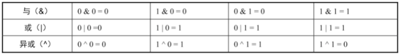

# 第一章 整数

## 1.1 基础知识

​	Java 中有4种不同的整数类型（都是有符号整数）：

- 8位的byte（-2^7～2^7-1）
- 16位的short （-215～215-1）
- 32位的int（-231～231-1）
- 64位的long（-263～263-1）

```java
/**
     * 题目：输入2个int型整数，它们进行除法计算并返回商，要求不得使用乘号'*'、除号'/'及求余符号'%'。当发生溢出时，返回最大的整数值。假设除数不为0。例如，输入15和2，输出15/2的结果，即7。
     *
     * @param dividend 被除数
     * @param divisor  除数
     * @return 商
     */
    public int divide(int dividend, int divisor) {
        // 最小值 除 -1 = 最大值
        if (dividend == Integer.MIN_VALUE && divisor == -1) {
            return Integer.MAX_VALUE;
        }
        // 负数个数
        int negative = 2;
        // 被除数是否为负数
        if (dividend > 0) {
            negative--;
            dividend = -dividend;
        }
        // 除数是否为负数
        if (divisor > 0) {
            negative--;
            divisor = -divisor;
        }
        int result = divideCore(dividend, divisor);
        return negative == 1 ? -result : result;
    }

    /**
     * 将被除数和除数转换成负数来进行计算
     *
     * @param dividend 被除数绝对值
     * @param divisor  除数绝对值
     * @return 商
     */
    private int divideCore(int dividend, int divisor) {
        int result = 0;
        while (dividend <= divisor) {
            int value = divisor;
            int quotient = 1;
          	// 0xc0000000 = -2^30 = Integer.MIN_VALUE / 2
            while (value >= 0xc0000000 && dividend <= value + value) {
                quotient += quotient;
                value += value;
            }
            result += quotient;
            dividend -= value;
        }
        return result;
    }
```

## 1.2 二进制

​	二进制运算（6种）：非、与、或、异或、左移、右移



​	左移运算符m＜＜n表示把m左移n位。如果左移n位，那么最左边的n位将被丢弃，同时在最右边补上n个0。

```tex
00001010 << 2=00101000
10001010 << 3=01010000
```

​	右移运算符m>>n表示把m右移n位。如果右移n位，则最右边的n位将被丢弃。如果数字原先是一个正数，则右移之后在最左边补n个0；如果数字原先是一个负数，则右移之后在最左边补n个1。

```tex
00001010 >> 2 = 00000010
10001010 >> 3 = 11110001
```

​	Java中增加了一种无符号右移位操作符“>>>”。无论是对正数还是负数进行无符号右移操作，都将在最左边插入0。（其他编程语言没有）

```
00001010>>>2=00000010
10001010>>>3=00010001
```

# 第二章

## 2.1 数组基本知识

略

## 2.2 双指针

**含义**：

​	使用两个相反方向或者相同方向的指针扫描数组。

​	方向相反的双指针经常用来求排序数组中的两个数字之和，P1指向数组中的第一个数字，P2指向数组中的最后一个数字，两个指针指向的数字之和大于目标值，则P2向左移动；如果小于目标值这P1指针向右移动，两个指针的移动方向是相反的；方向相同的双指针通常用来求正数数组中的和或乘积。

​	方向相同的双指针通常用来求正数数组中子数组的和或者乘积，初始化的时候两个指针P1和P2都指向数组的第1个数字。如果两个指针之间的子数组的和或乘积大于目标值，则向右移动指针P1删除子数组最左边的数字；如果两个指针之间的子数组的和或乘积小于目标值，则向右移动指针P2在子数组的右边增加新的数字。此时两个指针的移动方向是相同的。

```java
 /**
     * 题目：寻找有序数组中目标值的数组下标，数组中的每个元素只能使用一次
     *
     * @param data   有序数组
     * @param target 目标值
     * @return 结果为目标值的数组下标
     */
    public int[] twoSum(int[] data, int target) {
        if (data == null || data.length == 0)
            return null;
        if (data.length == 1)
            return data[0] == target ? new int[]{0} : null;
        int leftIndex = 0;
        int rightIndex = data.length - 1;
        while (leftIndex < rightIndex) {
            if (data[leftIndex] + data[rightIndex] < target)
                leftIndex++;
            else if (data[leftIndex] + data[rightIndex] > target)
                rightIndex--;
            else
                break;
        }
        return new int[]{leftIndex, rightIndex};
    }
```

