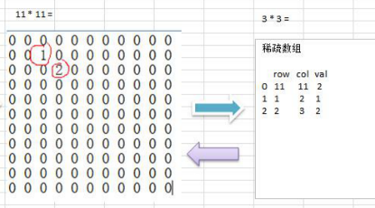

# 稀疏数组

## 图解




```java
 public static void test1() {
        //生成原始数组
        int chessArr[][] = new int[11][11];
        chessArr[1][2] = 1;
        chessArr[2][3] = 2;
        chessArr[4][5] = 2;
        //输出原始数组
        System.out.println("原始数组为");
        for (int[] row : chessArr) {
            for (int data : row) {
                System.out.printf("%d ", data);
            }
            System.out.println("\n");
        }
        //将二维数组转成稀疏数组
        // 1.先遍历一边获取非0 数据的个数
        int sum = 0;
        for (int i = 0; i < 11; i++) {
            for (int j = 0; j < 11; j++) {
                if (chessArr[i][j] != 0) {
                    sum++;
                }
            }
        }
        //创建对应的稀疏数组
        int[][] spareArr = new int[sum + 1][3];
        // 稀疏数组 原始表数据
        spareArr[0][0] = 11;
        spareArr[0][1] = 11;
        spareArr[0][2] = sum;

        //将非0 数据放入到spareArr中
        int count = 0;
        for (int i = 0; i < 11; i++) {
            for (int j = 0; j < 11; j++) {
                if (chessArr[i][j] != 0) {
                    count++;
                    spareArr[count][0] = i;
                    spareArr[count][1] = j;
                    spareArr[count][2] = chessArr[i][j];
                }
            }
        }
        // 输出稀疏数组的形式
        System.out.println("转换成稀疏数组");
        for (int[] row : spareArr) {
            for (int data : row) {
                System.out.printf("%d ", data);
            }
            System.out.println("\n");
        }

        // 恢复二维矩阵
        int[][] chessArr2 = null;
        for (int i = 0; i < spareArr.length; i++) {
            if (i ==0)
                chessArr2 = new int[spareArr[0][0]][spareArr[0][1]];
            else
                chessArr2[spareArr[i][0]][spareArr[i][1]] = spareArr[i][2];
        }

        //输出原始数组
        System.out.println("原始数组为");
        for (int[] row : chessArr2) {
            for (int data : row) {
                System.out.printf("%d ", data);
            }
            System.out.println("\n");
        }
    }
```

